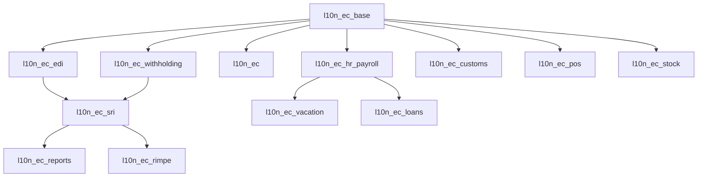

# Software Requirements Specification (SRS)
## Ecuador Localization - Odoo 18.0

**Document ID:** SRS-L10N-EC-2026-001
**Version:** 1.0.0
**Date:** 2026-01-25
**Classification:** Internal
**Author:** Somatech.dev

---

## 1. INTRODUCCIÓN

### 1.1 Propósito
Este documento especifica los requisitos de software para la localización ecuatoriana de Odoo 18.0, cumpliendo con regulaciones SRI, MDT, IESS y SENAE.

### 1.2 Alcance
- 21 módulos de localización
- Facturación electrónica SRI
- Retenciones IR/IVA
- Nómina ecuatoriana
- Aduanas (SENAE)
- Punto de venta

### 1.3 Referencias Regulatorias
| Entidad | Normativa | Descripción |
|:--------|:----------|:------------|
| SRI | NAC-DGERCGC25-00000017 | Comprobantes électrónicos 2026 |
| SRI | Ficha Técnica v2.1 | Estructura XML facturas |
| MDT | Acuerdo 2026 | SBU $482 |
| IESS | Resolución C.D. 2025 | Aportes 9.45%/12.15% |
| SENAE | Resolución SENAE-2025 | ECUAPASS |

---

## 2. ARQUITECTURA DE MÓDULOS

### 2.1 Jerarquía de Dependencias



### 2.2 Categorización de Módulos

#### CORE (Núcleo)
| Módulo | Archivos | Estado | Descripción |
|:-------|:---------|:-------|:------------|
| **l10n_ec_base** | 32 | ✅ Activo | Catálogos, config, RUC validation |
| **l10n_ec** | 10 | ✅ Activo | Wizard setup, glue module |

#### ACCOUNTING (Contabilidad)
| Módulo | Archivos | Estado | Descripción |
|:-------|:---------|:-------|:------------|
| **l10n_ec_edi** | 13 | ✅ Activo | Facturación electrónica XML |
| **l10n_ec_withholding** | 16 | ✅ Activo | Retenciones IR/IVA |
| **l10n_ec_sri** | 151 | ⚠️ Revisar | Integración SRI (muy grande) |
| **l10n_ec_income_tax** | 9 | ✅ Activo | Impuesto a la renta |
| **l10n_ec_ice** | 12 | ✅ Activo | Impuestos especiales |
| **l10n_ec_rimpe** | 9 | ✅ Activo | Régimen RIMPE |

#### PAYROLL (Nómina)
| Módulo | Archivos | Estado | Descripción |
|:-------|:---------|:-------|:------------|
| **l10n_ec_hr_payroll** | 14 | ✅ Activo | Roles, IESS, décimos |
| **l10n_ec_vacation** | 6 | ✅ Activo | Gestión vacaciones |
| **l10n_ec_loans** | 9 | ✅ Activo | Préstamos IESS |
| **l10n_ec_sut** | 6 | ✅ Activo | SUT MDT integration |

#### COMMERCE (Comercio)
| Módulo | Archivos | Estado | Descripción |
|:-------|:---------|:-------|:------------|
| **l10n_ec_pos** | 9 | ✅ Activo | Punto de venta |
| **l10n_ec_stock** | 11 | ✅ Activo | Guías remisión |
| **l10n_ec_customs** | 8 | ✅ Activo | Aduanas SENAE |
| **l10n_ec_bank_transfer** | 7 | ✅ Activo | Transferencias |

#### REPORTING (Reportería)
| Módulo | Archivos | Estado | Descripción |
|:-------|:---------|:-------|:------------|
| **l10n_ec_reports** | 10 | ✅ Activo | ATS, 103, 104 |
| **l10n_ec_asset** | 8 | ✅ Activo | Activos fijos |

#### UTILITY (Utilidades)
| Módulo | Archivos | Estado | Descripción |
|:-------|:---------|:-------|:------------|
| **l10n_ec_portal** | 7 | ✅ Activo | Portal cliente |
| **l10n_ec_quality** | 7 | ✅ Activo | Control calidad |

---

## 3. CATÁLOGOS REQUERIDOS

### 3.1 Catálogos Instalados en l10n_ec_base

| Catálogo | Modelo | Registros | Estado |
|:---------|:-------|:----------|:-------|
| Configuración 2026 | l10n_ec.config | 1 | ✅ OK |
| Retenciones IR | l10n_ec.retention.code | 14 | ✅ OK |
| Retenciones IVA | l10n_ec.retention.code | 6 | ✅ OK |
| Códigos Impuesto | l10n_ec.tax.code | 5 | ✅ OK |
| Formas de Pago | l10n_ec.payment.method | 8 | 🆕 Crear |
| Tipos Identificación | l10n_ec.identification.type | 5 | 🆕 Crear |
| Sustentos Tributarios | l10n_ec.tax.support | 11 | 🆕 Crear |
| Tipos Contribuyente | l10n_ec.contributor.type | 8 | 🆕 Crear |
| Provincias | l10n_ec.province | 24 | 🆕 Crear |
| Cantones | l10n_ec.canton | 221 | ⏳ Pendiente |
| Códigos CIIU | l10n_ec.ciiu | ~1500 | ⏳ Pendiente |

---

## 4. FLUJO DE INSTALACIÓN

### 4.1 Secuencia de Instalación

```
PASO 1: Instalar l10n_ec_base
         ├── Crear modelos catálogos
         ├── Cargar configuración 2026
         ├── Cargar retenciones IR/IVA
         ├── Cargar formas pago
         ├── Cargar tipos identificación
         ├── Cargar provincias
         └── Cargar plan de cuentas

PASO 2: Instalar l10n_ec (glue)
         ├── Ejecutar wizard configuración
         ├── Configurar RUC empresa
         └── Auto-cargar datos SRI

PASO 3: Instalar l10n_ec_edi
         ├── Subir certificado .p12
         ├── Configurar punto emisión
         └── Crear secuencias

PASO 4: Instalar l10n_ec_withholding
         └── Habilitar retenciones

PASO 5: Instalar módulos adicionales según necesidad
```

### 4.2 Wizard Configuración Empresa

```
┌─────────────────────────────────────────────────────────────┐
│  PASO 1: DATOS SRI                                         │
│  ┌─────────────────────────────────────────────────────────┐│
│  │ RUC: [______________] → Auto-consulta SRI              ││
│  │ Razón Social: [CARGADO AUTOMÁTICAMENTE]                ││
│  │ Estado: ACTIVO ✅                                       ││
│  │ Obligado Contabilidad: [✓]                             ││
│  └─────────────────────────────────────────────────────────┘│
├─────────────────────────────────────────────────────────────┤
│  PASO 2: PLAN DE CUENTAS                                   │
│  ○ Plan Ecuador NIIF PYMES (Recomendado)                   │
│  ○ Plan Ecuador NIF                                        │
│  ○ Importar desde Excel                                    │
├─────────────────────────────────────────────────────────────┤
│  PASO 3: FACTURACIÓN ELECTRÓNICA                           │
│  Certificado: [Subir .p12]                                 │
│  Establecimiento: [001]  Punto Emisión: [001]              │
├─────────────────────────────────────────────────────────────┤
│  PASO 4: NÓMINA                                            │
│  Región: ○ Sierra  ○ Costa                                 │
│  Período: ○ Mensual  ○ Quincenal                           │
├─────────────────────────────────────────────────────────────┤
│  PASO 5: DATOS DEMO                                        │
│  ☐ Cargar clientes demo (20)                               │
│  ☐ Cargar productos demo (30)                              │
├─────────────────────────────────────────────────────────────┤
│  PASO 6: CONFIRMAR                                         │
│  [✅ Finalizar Configuración]                               │
└─────────────────────────────────────────────────────────────┘
```

---

## 5. FLUJOS DE NEGOCIO

### 5.1 Flujo Factura de Venta

```
1. CREAR FACTURA
   ├── Seleccionar cliente (validar RUC/Cédula)
   ├── Agregar productos
   ├── Calcular IVA (15%/5%/0%)
   └── Validar límite consumidor final ($50)

2. CONFIRMAR FACTURA
   ├── Generar XML según Ficha Técnica SRI
   ├── Firmar con certificado P12
   └── Asignar secuencia (001-001-XXXXXXXXX)

3. ENVIAR AL SRI
   ├── POST a RecepcionComprobantes (SOAP)
   ├── Recibir clave de acceso (49 dígitos)
   └── Esperar autorización

4. OBTENER AUTORIZACIÓN
   ├── GET AutorizacionComprobantes
   ├── Almacenar número autorización
   └── Generar PDF RIDE

5. ENTREGAR AL CLIENTE
   └── Email con XML + PDF
```

### 5.2 Flujo Retención en Compra

```
1. REGISTRAR FACTURA PROVEEDOR
   ├── Ingresar datos factura recibida
   ├── Validar RUC proveedor
   └── Registrar fecha emisión

2. CALCULAR RETENCIÓN (dentro de 5 días)
   ├── Determinar código IR según concepto
   │   ├── 303 (10%) - Honorarios
   │   ├── 312 (1%) - Bienes
   │   └── 307 (2%) - Servicios mano obra
   ├── Determinar código IVA según proveedor
   │   ├── 721 (10%) - Bienes
   │   └── 723 (20%) - Servicios
   └── Calcular montos

3. GENERAR COMPROBANTE RETENCIÓN
   ├── Crear XML tipo 07
   ├── Firmar electrónicamente
   └── Enviar al SRI

4. ENTREGAR AL PROVEEDOR
   └── Dentro de 5 días hábiles
```

### 5.3 Flujo Rol de Pagos

```
1. CONFIGURAR EMPLEADO
   ├── Datos personales
   ├── Contrato (fecha inicio, salario)
   ├── Departamento y cargo
   └── Región (Sierra/Costa)

2. GENERAR ROL MENSUAL
   ├── INGRESOS
   │   ├── Sueldo base
   │   ├── Horas extras (+50%/+100%)
   │   ├── Comisiones
   │   └── Otros ingresos
   │
   ├── DESCUENTOS
   │   ├── IESS Personal (9.45%)
   │   ├── Préstamos IESS
   │   ├── Anticipos
   │   └── Otros descuentos
   │
   └── PROVISIONES
       ├── Décimo tercero (1/12)
       ├── Décimo cuarto (SBU/12)
       ├── Vacaciones (1/24)
       └── Fondos reserva (8.33%)

3. GENERAR ARCHIVOS IESS
   └── Planilla aportes

4. PAGAR NÓMINA
   └── Transferencia bancaria
```

---

## 6. ESTRUCTURA DE ARCHIVOS

### 6.1 l10n_ec_base (Módulo Core)

```
l10n_ec_base/
├── __init__.py
├── __manifest__.py
├── data/
│   ├── l10n_ec_config_data.xml      # Parámetros 2026
│   ├── l10n_ec_catalogs_data.xml    # Catálogos SRI 🆕
│   ├── l10n_ec_sri_config.xml       # Config SRI
│   ├── account_chart_template.xml   # Plan cuentas
│   ├── account.account.template.csv # Cuentas
│   ├── account.tax.template.csv     # Impuestos
│   └── l10n_latam.document.type.csv # Tipos doc
├── models/
│   ├── __init__.py
│   ├── res_partner.py               # RUC/Cédula validation
│   ├── l10n_ec_config.py            # Configuración dinámica
│   ├── l10n_ec_catalogs.py          # Catálogos SRI 🆕
│   ├── l10n_ec_sri_ruc_service.py   # Consulta SRI
│   ├── tax_calendar.py              # Calendario fiscal
│   └── purchase_order.py            # Extensiones compra
├── mcp/                              # MCP Tools
│   ├── sri_data_loader.py
│   ├── partner_manager.py
│   ├── invoice_manager.py
│   ├── retention_manager.py
│   ├── payroll_manager.py
│   └── demo_data_generator.py
├── security/
│   ├── l10n_ec_groups.xml
│   └── ir.model.access.csv
├── views/
│   ├── res_partner_views.xml
│   └── res_company_views.xml
└── tests/
```

---

## 7. VALIDACIONES CRÍTICAS

### 7.1 Validaciones RUC/Cédula

| Tipo | Longitud | Algoritmo | Ejemplo |
|:-----|:---------|:----------|:--------|
| Cédula | 10 | Módulo 10 | 1710034065 |
| RUC Natural | 13 | Módulo 10 + 001 | 1710034065001 |
| RUC Sociedad | 13 | Módulo 11 | 1790016919001 |
| RUC Público | 13 | Especial (6) | 1760001550001 |

### 7.2 Reglas de Negocio SRI

| Regla | Plazo | Consecuencia |
|:------|:------|:-------------|
| Emitir retención | 5 días hábiles | Multa + intereses |
| Anular factura | 7 días | Requiere NC si >7 días |
| Declarar IVA | Día 28 siguiente | Multa |
| Pagar décimo tercero | 24 diciembre | Multa MDT |
| Pagar décimo cuarto | 15 marzo/agosto | Multa MDT |
| Pagar utilidades | 15 abril | Multa MDT |

---

## 8. PENDIENTES Y RECOMENDACIONES

### 8.1 Acciones Inmediatas

1. ✅ Actualizar manifest con l10n_ec_catalogs_data.xml
2. ✅ Agregar security access para nuevos modelos
3. ⏳ Cargar 221 cantones de Ecuador
4. ⏳ Cargar códigos CIIU (~1500 registros)
5. ⏳ Revisar módulo l10n_ec_sri (151 archivos - muy grande)

### 8.2 Módulos a Revisar/Consolidar

| Módulo | Acción | Razón |
|:-------|:-------|:------|
| l10n_ec_sri | Refactorizar | 151 archivos, muy grande |
| l10n_ec_sut | Integrar | Puede ir en l10n_ec_hr_payroll |
| l10n_ec_vacation | Integrar | Puede ir en l10n_ec_hr_payroll |

---

## 9. APROBACIONES

| Rol | Nombre | Fecha | Firma |
|:----|:-------|:------|:------|
| Arquitecto | __________ | ______ | ______ |
| QA Lead | __________ | ______ | ______ |
| Product Owner | __________ | ______ | ______ |

---

**FIN DEL DOCUMENTO SRS-L10N-EC-2026-001**
