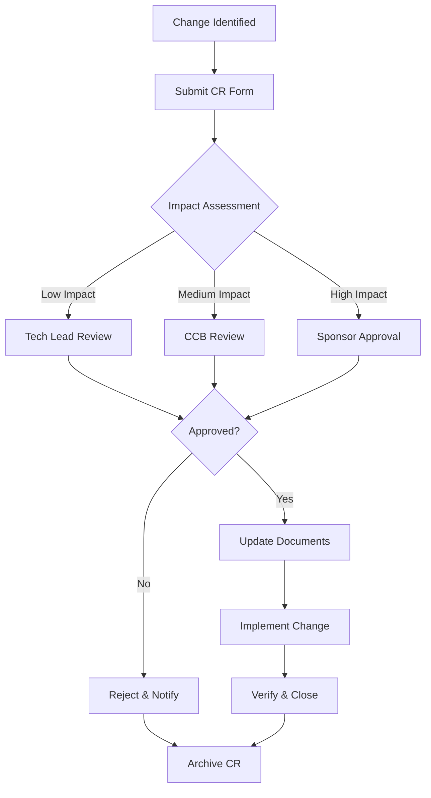

# CHANGE CONTROL PROCEDURE
## PMI Integrated Change Control & ISO 9001:2015 Compliance

**Document ID**: CCP-001
**Version**: 1.0
**Effective Date**: 2026-01-22
**Owner**: Project Manager

---

## 1. PURPOSE

This procedure establishes the formal process for requesting, evaluating, approving, and implementing changes to project scope, schedule, cost, or deliverables.

---

## 2. SCOPE

Applies to ALL changes affecting:
- Project scope or requirements
- Technical specifications (SRS documents)
- Process flows and data mappings
- Configuration checklists
- Regulatory compliance items
- Schedule or budget

---

## 3. CHANGE REQUEST PROCESS



---

## 4. CHANGE REQUEST FORM

### CR-[YYYY]-[NNN]

| Field | Value |
|:------|:------|
| **CR Number** | CR-2026-___ |
| **Date Submitted** | |
| **Requestor** | |
| **Priority** | ☐ Critical ☐ High ☐ Medium ☐ Low |
| **Category** | ☐ Scope ☐ Technical ☐ Regulatory ☐ Schedule ☐ Budget |

#### 4.1 Description of Change
```
[Describe the proposed change in detail]
```

#### 4.2 Business Justification
```
[Why is this change needed? What problem does it solve?]
```

#### 4.3 Impact Analysis

| Area | Impact | Details |
|:-----|:-------|:--------|
| Scope | ☐ Yes ☐ No | |
| Schedule | ☐ Yes ☐ No | +/- days: |
| Budget | ☐ Yes ☐ No | +/- USD: |
| Quality | ☐ Yes ☐ No | |
| Risk | ☐ Yes ☐ No | |
| Resources | ☐ Yes ☐ No | |

#### 4.4 Affected Documents
| Doc ID | Document Name | Required Update |
|:-------|:--------------|:----------------|
| | | |

#### 4.5 Approval

| Role | Name | Decision | Date | Signature |
|:-----|:-----|:---------|:-----|:----------|
| Requestor | | Submitted | | |
| Tech Lead | | ☐ Approve ☐ Reject | | |
| PM | | ☐ Approve ☐ Reject | | |
| CCB | | ☐ Approve ☐ Reject | | |
| Sponsor | | ☐ Approve ☐ Reject | | |

---

## 5. CHANGE CLASSIFICATION

### 5.1 Impact Levels

| Level | Definition | Approval Authority | SLA |
|:------|:-----------|:-------------------|:----|
| **Critical** | Regulatory compliance, legal, security | Sponsor + CCB | 24 hrs |
| **High** | Major scope/schedule impact (>5 days or >$5K) | Project Manager + CCB | 3 days |
| **Medium** | Moderate impact (2-5 days or $1K-$5K) | Project Manager | 5 days |
| **Low** | Minor changes (<2 days or <$1K) | Tech Lead | 7 days |

### 5.2 Change Categories

| Category | Examples |
|:---------|:---------|
| **Scope** | New requirements, removed features |
| **Technical** | Architecture changes, API modifications |
| **Regulatory** | SRI updates, IESS rate changes, new laws |
| **Schedule** | Milestone shifts, resource changes |
| **Budget** | Cost overruns, new expenses |
| **Quality** | Test criteria changes, acceptance criteria |

---

## 6. CHANGE CONTROL BOARD (CCB)

### 6.1 Composition

| Role | Responsibility |
|:-----|:---------------|
| Project Manager (Chair) | Facilitates meetings, tracks CRs |
| Technical Architect | Assesses technical impact |
| Business Analyst | Assesses business impact |
| QA Lead | Assesses testing impact |
| Compliance Officer | Assesses regulatory impact |
| Sponsor (as needed) | Final authority on high-impact changes |

### 6.2 Meeting Schedule

- **Regular CCB**: Weekly (Fridays 10:00 AM)
- **Emergency CCB**: Within 24 hours for Critical changes

---

## 7. CHANGE IMPLEMENTATION

### 7.1 After Approval

1. **Update Documents**
   - Increment version numbers
   - Update Document Control Matrix
   - Record in change log

2. **Notify Stakeholders**
   - Distribution per affected documents
   - Training if required

3. **Implement**
   - Code/configuration changes
   - Update test cases

4. **Verify**
   - Execute relevant tests
   - Compliance verification

5. **Close**
   - CR status → Closed
   - Archive records

### 7.2 Version Numbering After Change

| Change Type | Version Increment |
|:------------|:------------------|
| Major (breaking) | X.0 → (X+1).0 |
| Minor (non-breaking) | X.Y → X.(Y+1) |
| Patch (typo/clarification) | X.Y.Z → X.Y.(Z+1) |

---

## 8. EMERGENCY CHANGES

For critical production issues or regulatory deadlines:

1. **Verbal Approval**: PM or Sponsor (documented within 24 hrs)
2. **Implement Immediately**: With safety measures
3. **Retrospective CR**: Submit formal CR within 48 hours
4. **CCB Review**: Next scheduled meeting

---

## 9. CHANGE LOG

| CR # | Date | Description | Category | Status |
|:-----|:-----|:------------|:---------|:-------|
| CR-2026-001 | 2026-01-22 | Initial documentation suite | Scope | ✅ Closed |
| | | | | |

---

## 10. METRICS

| Metric | Target | Measurement |
|:-------|:-------|:------------|
| CR Approval Time | ≤ SLA | Days from submit to decision |
| CR Rejection Rate | < 20% | Rejected / Total submitted |
| Emergency CR Rate | < 5% | Emergency / Total |
| Documentation Compliance | 100% | CRs with complete updates |

---

## 11. REFERENCES

- PMI PMBOK® Guide, 7th Edition - Integrated Change Control
- ISO 9001:2015 - Clause 7.5.3 (Control of Documented Information)
- Project Charter: [PMI_PROJECT_CHARTER.md](./PMI_PROJECT_CHARTER.md)
- Document Control Matrix: [DOC_CONTROL_MATRIX.md](./DOC_CONTROL_MATRIX.md)

---

**Change Control Classification**: ISO 9001:2015 Controlled Procedure
