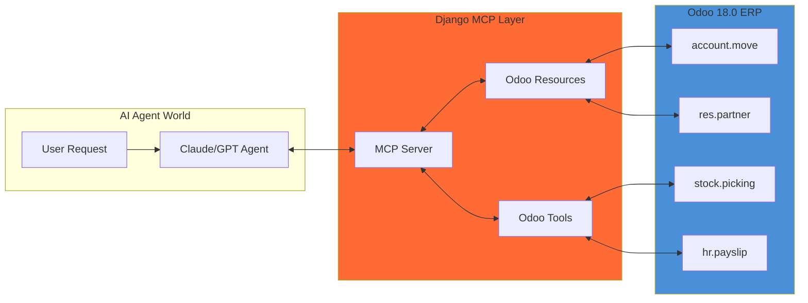

# MCP ARCHITECTURE: ODOO AS AI AGENT BACKEND
## Wrapping the Entire ERP for Model Context Protocol

**Document Identifier**: SOMA-MCP-ARCH-001
**Version**: 1.0
**Date**: 2026-01-22
**Status**: ARCHITECTURAL VISION

---

## 1. THE VISION

> **"Agent, bring me all invoices for Provider X and show them to me."**

This is the goal. AI Agents can interact with the entire Odoo ERP through natural language, and the MCP layer translates that into real ERP operations.



---

## 2. MCP COMPONENTS

### 2.1 Resources (Read Operations)

Resources expose Odoo data to agents for reading:

```python
# django_mcp/resources/odoo_resources.py
from mcp.server import Resource
from django_mcp.odoo_client import OdooRPC

class InvoiceResource(Resource):
    """MCP Resource: Access Odoo Invoices"""

    uri = "odoo://account.move/invoices"
    name = "Odoo Invoices"
    description = "Query and retrieve invoices from Odoo ERP"

    async def read(self, params: dict) -> list:
        """
        Agent: "Get all invoices for provider Acme Corp"
        Params: {"partner_name": "Acme Corp", "move_type": "in_invoice"}
        """
        odoo = OdooRPC()
        domain = []

        if params.get('partner_name'):
            partner_ids = odoo.search('res.partner', [
                ('name', 'ilike', params['partner_name'])
            ])
            domain.append(('partner_id', 'in', partner_ids))

        if params.get('move_type'):
            domain.append(('move_type', '=', params['move_type']))

        if params.get('state'):
            domain.append(('state', '=', params['state']))

        invoices = odoo.search_read('account.move', domain, [
            'name', 'partner_id', 'invoice_date', 'amount_total',
            'l10n_ec_sri_status', 'l10n_ec_sri_access_key', 'state'
        ])

        return invoices
```

### 2.2 Tools (Write Operations)

Tools allow agents to perform actions in Odoo:

```python
# django_mcp/tools/odoo_tools.py
from mcp.server import Tool
from django_mcp.odoo_client import OdooRPC

class CreateInvoiceTool(Tool):
    """MCP Tool: Create Invoice in Odoo"""

    name = "create_invoice"
    description = "Create a new customer or vendor invoice in Odoo"

    input_schema = {
        "type": "object",
        "properties": {
            "partner_name": {"type": "string", "description": "Customer/Vendor name"},
            "move_type": {"type": "string", "enum": ["out_invoice", "in_invoice"]},
            "lines": {
                "type": "array",
                "items": {
                    "type": "object",
                    "properties": {
                        "product": {"type": "string"},
                        "quantity": {"type": "number"},
                        "price": {"type": "number"}
                    }
                }
            }
        },
        "required": ["partner_name", "move_type", "lines"]
    }

    async def execute(self, params: dict) -> dict:
        """
        Agent: "Create an invoice for Customer ABC with 10 units of Product X at $50 each"
        """
        odoo = OdooRPC()

        # Find or create partner
        partner_id = odoo.find_or_create_partner(params['partner_name'])

        # Create invoice
        invoice_id = odoo.create('account.move', {
            'move_type': params['move_type'],
            'partner_id': partner_id,
            'invoice_line_ids': [
                (0, 0, {
                    'name': line['product'],
                    'quantity': line['quantity'],
                    'price_unit': line['price'],
                }) for line in params['lines']
            ]
        })

        invoice = odoo.read('account.move', invoice_id, ['name', 'amount_total'])
        return {"success": True, "invoice": invoice}


class SendToSRITool(Tool):
    """MCP Tool: Send invoice to SRI for authorization"""

    name = "send_to_sri"
    description = "Send an Odoo invoice to Ecuador SRI for electronic authorization"

    input_schema = {
        "type": "object",
        "properties": {
            "invoice_id": {"type": "integer", "description": "Odoo invoice ID"},
            "invoice_name": {"type": "string", "description": "Invoice number (e.g., INV/2026/0001)"}
        }
    }

    async def execute(self, params: dict) -> dict:
        """
        Agent: "Send invoice INV/2026/0001 to SRI"
        """
        odoo = OdooRPC()

        if params.get('invoice_name'):
            invoice_id = odoo.search('account.move', [
                ('name', '=', params['invoice_name'])
            ])[0]
        else:
            invoice_id = params['invoice_id']

        # Call Odoo's SRI send action
        result = odoo.execute('account.move', 'action_send_sri', [invoice_id])

        # Get updated status
        invoice = odoo.read('account.move', invoice_id, [
            'l10n_ec_sri_status', 'l10n_ec_sri_access_key', 'l10n_ec_sri_error'
        ])

        return {"success": True, "sri_status": invoice['l10n_ec_sri_status']}
```

---

## 3. COMPLETE RESOURCE LIST

Every Odoo model the agent might need:

| Resource URI | Model | Description |
|:-------------|:------|:------------|
| `odoo://account.move/invoices` | `account.move` | Customer/Vendor Invoices |
| `odoo://account.move/payments` | `account.payment` | Payments |
| `odoo://res.partner/customers` | `res.partner` | Customers |
| `odoo://res.partner/vendors` | `res.partner` | Vendors |
| `odoo://product.product/products` | `product.product` | Products |
| `odoo://stock.picking/deliveries` | `stock.picking` | Delivery Orders |
| `odoo://l10n_ec.retention/retentions` | `l10n_ec.retention` | Withholding Certs |
| `odoo://hr.payslip/payslips` | `hr.payslip` | Payroll |
| `odoo://purchase.order/purchases` | `purchase.order` | Purchase Orders |
| `odoo://sale.order/sales` | `sale.order` | Sales Orders |

---

## 4. COMPLETE TOOL LIST

Every action the agent can perform:

| Tool Name | Odoo Action | Description |
|:----------|:------------|:------------|
| `create_invoice` | `account.move.create()` | Create invoice |
| `post_invoice` | `account.move.action_post()` | Confirm invoice |
| `send_to_sri` | `account.move.action_send_sri()` | Send to SRI |
| `check_sri_status` | `account.move.action_check_sri()` | Check authorization |
| `create_payment` | `account.payment.create()` | Register payment |
| `create_retention` | `l10n_ec.retention.create()` | Create withholding |
| `send_retention_sri` | `l10n_ec.retention.action_send_sri()` | Send retention to SRI |
| `create_delivery` | `stock.picking.create()` | Create delivery |
| `validate_delivery` | `stock.picking.button_validate()` | Confirm delivery |
| `generate_guia` | `stock.picking.action_generate_guia()` | Generate Guía de Remisión |
| `run_payroll` | `hr.payslip.compute_sheet()` | Calculate payroll |
| `generate_ats` | `l10n_ec.reports.generate_ats()` | Generate ATS XML |

---

## 5. DJANGO MCP SERVER IMPLEMENTATION

```python
# django_mcp/server.py
from mcp.server import Server
from django_mcp.resources import (
    InvoiceResource,
    PartnerResource,
    ProductResource,
    RetentionResource,
    PayslipResource,
)
from django_mcp.tools import (
    CreateInvoiceTool,
    PostInvoiceTool,
    SendToSRITool,
    CreateRetentionTool,
    GenerateATSTool,
)

# Initialize MCP Server
server = Server("odoo-ecuador-mcp")

# Register all resources (READ)
server.register_resource(InvoiceResource())
server.register_resource(PartnerResource())
server.register_resource(ProductResource())
server.register_resource(RetentionResource())
server.register_resource(PayslipResource())

# Register all tools (WRITE)
server.register_tool(CreateInvoiceTool())
server.register_tool(PostInvoiceTool())
server.register_tool(SendToSRITool())
server.register_tool(CreateRetentionTool())
server.register_tool(GenerateATSTool())

# Run server
if __name__ == "__main__":
    server.run()
```

---

## 6. ODOO RPC CLIENT

```python
# django_mcp/odoo_client.py
import xmlrpc.client
from django.conf import settings

class OdooRPC:
    """XML-RPC client to communicate with Odoo"""

    def __init__(self):
        self.url = settings.ODOO_URL
        self.db = settings.ODOO_DB
        self.username = settings.ODOO_USER
        self.password = settings.ODOO_PASSWORD

        # Connect
        common = xmlrpc.client.ServerProxy(f'{self.url}/xmlrpc/2/common')
        self.uid = common.authenticate(self.db, self.username, self.password, {})
        self.models = xmlrpc.client.ServerProxy(f'{self.url}/xmlrpc/2/object')

    def search(self, model, domain):
        return self.models.execute_kw(
            self.db, self.uid, self.password,
            model, 'search', [domain]
        )

    def search_read(self, model, domain, fields):
        return self.models.execute_kw(
            self.db, self.uid, self.password,
            model, 'search_read', [domain], {'fields': fields}
        )

    def read(self, model, ids, fields):
        return self.models.execute_kw(
            self.db, self.uid, self.password,
            model, 'read', [ids], {'fields': fields}
        )

    def create(self, model, values):
        return self.models.execute_kw(
            self.db, self.uid, self.password,
            model, 'create', [values]
        )

    def execute(self, model, method, ids, *args):
        return self.models.execute_kw(
            self.db, self.uid, self.password,
            model, method, [ids] + list(args)
        )
```

---

## 7. AGENT CONVERSATION EXAMPLES

### Example 1: Invoice Query
```
User: "Show me all unpaid invoices from Provider ABC"

Agent uses: InvoiceResource.read({
    "partner_name": "ABC",
    "move_type": "in_invoice",
    "state": "posted",
    "payment_state": "not_paid"
})

Agent Response: "I found 3 unpaid invoices from Provider ABC:
1. BILL/2026/0001 - $5,000.00 (Due: Feb 15)
2. BILL/2026/0003 - $2,500.00 (Due: Feb 20)
3. BILL/2026/0007 - $1,200.00 (Due: Mar 01)
Total outstanding: $8,700.00"
```

### Example 2: SRI Transmission
```
User: "Send all pending invoices to SRI"

Agent uses:
1. InvoiceResource.read({"l10n_ec_sri_status": "draft", "state": "posted"})
2. For each: SendToSRITool.execute({"invoice_id": id})

Agent Response: "I've sent 5 invoices to SRI:
- INV/2026/0015: ✓ AUTHORIZED (Access Key: 2201202601...)
- INV/2026/0016: ✓ AUTHORIZED
- INV/2026/0017: ✗ REJECTED (Error: Invalid RUC)
- INV/2026/0018: ✓ AUTHORIZED
- INV/2026/0019: ✓ AUTHORIZED

4 authorized, 1 rejected. Would you like me to fix the rejected one?"
```

### Example 3: Payroll Query
```
User: "What's the total payroll for January 2026?"

Agent uses: PayslipResource.read({
    "date_from": "2026-01-01",
    "date_to": "2026-01-31",
    "state": "done"
})

Agent Response: "January 2026 Payroll Summary:
- Total Gross: $125,000.00
- IESS Employee (9.45%): $11,812.50
- IESS Employer (11.65%): $14,562.50
- Net to Employees: $113,187.50
- 75 payslips processed"
```

---

## 8. ARCHITECTURE DIAGRAM

```
┌─────────────────────────────────────────────────────────────────────┐
│                         AI AGENT (Claude/GPT)                       │
│  "Show me all invoices from Provider X and their SRI status"        │
└───────────────────────────────┬─────────────────────────────────────┘
                                │ MCP Protocol
                                ▼
┌─────────────────────────────────────────────────────────────────────┐
│                     DJANGO MCP SERVER                               │
│  ┌─────────────────────────────────────────────────────────────┐   │
│  │                     MCP Resources                            │   │
│  │  odoo://account.move/invoices                               │   │
│  │  odoo://res.partner/customers                               │   │
│  │  odoo://l10n_ec.retention/retentions                        │   │
│  └─────────────────────────────────────────────────────────────┘   │
│  ┌─────────────────────────────────────────────────────────────┐   │
│  │                      MCP Tools                               │   │
│  │  send_to_sri, create_invoice, generate_ats                   │   │
│  └─────────────────────────────────────────────────────────────┘   │
│  ┌─────────────────────────────────────────────────────────────┐   │
│  │                   Odoo RPC Client                            │   │
│  │  XML-RPC connection to Odoo 18.0                             │   │
│  └─────────────────────────────────────────────────────────────┘   │
└───────────────────────────────┬─────────────────────────────────────┘
                                │ XML-RPC
                                ▼
┌─────────────────────────────────────────────────────────────────────┐
│                     ODOO 18.0 ERP                                   │
│  ┌───────────┐  ┌───────────┐  ┌───────────┐  ┌───────────┐        │
│  │ account   │  │ l10n_ec   │  │  stock    │  │ hr_payroll│        │
│  │ .move     │  │ .retention│  │ .picking  │  │ .payslip  │        │
│  └───────────┘  └───────────┘  └───────────┘  └───────────┘        │
│                        ▼                                            │
│  ┌─────────────────────────────────────────────────────────────┐   │
│  │              SRI Electronic Invoicing (l10n_ec_edi)          │   │
│  │              XAdES Signing → SOAP → SRI                      │   │
│  └─────────────────────────────────────────────────────────────┘   │
└─────────────────────────────────────────────────────────────────────┘
                                │
                                ▼
┌─────────────────────────────────────────────────────────────────────┐
│                     EXTERNAL SERVICES                               │
│  ┌──────────┐  ┌──────────┐  ┌──────────┐  ┌──────────┐            │
│  │   SRI    │  │   IESS   │  │  SENAE   │  │ Banks    │            │
│  └──────────┘  └──────────┘  └──────────┘  └──────────┘            │
└─────────────────────────────────────────────────────────────────────┘
```

---

**This is the complete MCP architecture for AI Agent access to Odoo ERP.**
