# PROCESS FLOWS: INVOICE-TO-CASH (I2C)
## Order-to-Cash with Ecuador SRI Electronic Invoicing

**Document ID**: PF-I2C-001
**Version**: 1.0
**Classification**: Big 4 Professional Grade

---

## 1. END-TO-END PROCESS FLOW

```mermaid
flowchart TD
    subgraph SALES["Sales Department"]
        A[Customer Order Received] --> B{New Customer?}
        B -->|Yes| C[Create Partner<br/>Validate RUC/Cédula]
        B -->|No| D[Select Existing Partner]
        C --> E[Partner Validation<br/>stdnum.ec.ruc/ci]
        E -->|Invalid| F[Reject - Request Valid ID]
        E -->|Valid| D
        D --> G[Create Sales Order]
        G --> H[Confirm SO]
    end

    subgraph WAREHOUSE["Warehouse"]
        H --> I[Create Delivery Order]
        I --> J[Pick & Pack]
        J --> K[Validate Delivery]
        K --> L{Requires<br/>Guía de Remisión?}
        L -->|Yes| M[Generate Guía XML]
        M --> N[XAdES Sign Guía]
        N --> O[SRI Reception]
        O --> P[SRI Authorization]
        P --> Q[Attach Authorized Guía]
        L -->|No| R[Skip Guía]
        Q --> R
    end

    subgraph ACCOUNTING["Accounting / Invoicing"]
        R --> S[Create Invoice from SO]
        S --> T{Consumidor Final?}
        T -->|Yes| U{Amount > $50?}
        U -->|Yes| V[❌ BLOCK<br/>Require Identification]
        U -->|No| W[Allow CF Invoice]
        T -->|No| W
        W --> X[action_post<br/>Validate Invoice]
        X --> Y[Generate Access Key<br/>Módulo 11]
        Y --> Z[Render XML<br/>Jinja2 Template]
        Z --> AA[Validate XSD<br/>factura.xsd v2.1.0]
        AA -->|Invalid| AB[Fix XML Errors]
        AB --> Z
        AA -->|Valid| AC[XAdES-BES Sign<br/>Rust/Python]
        AC --> AD[Base64 Encode]
        AD --> AE[SRI Reception<br/>validarComprobante]
        AE --> AF{Estado?}
        AF -->|RECIBIDA| AG[Poll Authorization<br/>autorizacionComprobante]
        AF -->|DEVUELTA| AH[Parse Errors]
        AH --> AI[Display Error<br/>Retry Option]
        AI --> Z
        AG --> AJ{Estado?}
        AJ -->|AUTORIZADO| AK[Store Authorization<br/>numero_autorizacion]
        AJ -->|NO AUTORIZADO| AI
        AK --> AL[Generate RIDE PDF<br/>QR Code Included]
        AL --> AM[Email to Customer<br/>XML + PDF]
        AM --> AN[Invoice Complete<br/>autorizado_sri=True]
    end

    subgraph COLLECTIONS["Collections"]
        AN --> AO[Monitor A/R Aging]
        AO --> AP{Payment Received?}
        AP -->|Yes| AQ[Record Payment<br/>Reconcile]
        AP -->|No - Overdue| AR[Collection Actions]
        AR --> AP
        AQ --> AS[Close Invoice]
    end
```

---

## 2. DECISION POINT SPECIFICATIONS

### 2.1 DP-001: New Customer Check
| Attribute | Specification |
|:----------|:--------------|
| **Decision** | Is this a new customer not in Odoo? |
| **Input** | Customer name, RUC/Cédula |
| **Output** | Existing `res.partner` OR new partner workflow |
| **System Check** | Search `res.partner.vat` for match |

### 2.2 DP-002: Partner Validation
| Attribute | Specification |
|:----------|:--------------|
| **Decision** | Is the identification number valid? |
| **Input** | RUC (13 digits) or Cédula (10 digits) |
| **Validation** | `stdnum.ec.ruc.is_valid()` or `stdnum.ec.ci.is_valid()` |
| **Success** | Allow partner creation |
| **Failure** | Display validation error, block creation |

### 2.3 DP-003: Guía de Remisión Required
| Attribute | Specification |
|:----------|:--------------|
| **Decision** | Must a Guía accompany this delivery? |
| **Rule** | Required if: |
| | - Delivery to different address than establishment |
| | - Inter-company transfer |
| | - External transport used |
| **Exception** | Same-address internal movement |

### 2.4 DP-004: Consumidor Final Amount Check
| Attribute | Specification |
|:----------|:--------------|
| **Decision** | Is CF invoice over $50 limit? |
| **Legal Basis** | UAFE Anti-Money Laundering |
| **Check** | `partner.vat == '9999999999999' AND amount_total > 50` |
| **Action if True** | Block invoice, require identification |

### 2.5 DP-005: SRI Reception Status
| Attribute | Specification |
|:----------|:--------------|
| **Decision** | Was XML accepted by SRI? |
| **Values** | RECIBIDA = accepted / DEVUELTA = rejected |
| **On RECIBIDA** | Proceed to authorization polling |
| **On DEVUELTA** | Parse `mensajes`, display errors, retry |

### 2.6 DP-006: SRI Authorization Status
| Attribute | Specification |
|:----------|:--------------|
| **Decision** | Is document authorized? |
| **Values** | AUTORIZADO / NO AUTORIZADO |
| **On AUTORIZADO** | Store `numeroAutorizacion`, generate RIDE |
| **On NO AUTORIZADO** | Display errors, investigate |

---

## 3. ACTIVITY SPECIFICATIONS

### 3.1 ACT-001: Generate Access Key
| Attribute | Specification |
|:----------|:--------------|
| **Description** | Generate 49-digit SRI access key |
| **Method** | `SriService.create_access_key()` |
| **Algorithm** | Módulo 11 check digit |
| **Structure** | `DDMMYYYY` + `TT` + `RUC` + `E` + `EST` + `PTO` + `SEQ` + `CODE` + `ET` + `CHECK` |
| **Output** | 49-character string stored in `clave_acceso` |

### 3.2 ACT-002: XAdES-BES Sign
| Attribute | Specification |
|:----------|:--------------|
| **Description** | Apply XAdES-BES enveloped signature |
| **Certificate** | Company P12 file (`company.electronic_signature`) |
| **Algorithm** | RSA-SHA1 |
| **Canonicalization** | C14N |
| **Output** | Signed XML with `<ds:Signature>` element |

### 3.3 ACT-003: SRI Reception
| Attribute | Specification |
|:----------|:--------------|
| **Description** | Submit signed XML to SRI |
| **Endpoint** | `validarComprobante(xml_base64)` |
| **Test URL** | `https://celcer.sri.gob.ec/...RecepcionComprobantesOffline?wsdl` |
| **Prod URL** | `https://cel.sri.gob.ec/...RecepcionComprobantesOffline?wsdl` |
| **Timeout** | 30 seconds |
| **Retry** | 3 attempts with exponential backoff |

---

## 4. EXCEPTION HANDLING

### 4.1 EXH-001: Invalid RUC/Cédula
| Attribute | Specification |
|:----------|:--------------|
| **Trigger** | `stdnum` validation fails |
| **Action** | Display error message, prevent partner save |
| **Message** | "El número de identificación no es válido según el algoritmo de verificación" |
| **Resolution** | User corrects number or contacts customer |

### 4.2 EXH-002: SRI Service Unavailable
| Attribute | Specification |
|:----------|:--------------|
| **Trigger** | SOAP timeout or connection error |
| **Action** | Log error, set status to `pending_retry` |
| **Message** | "Servicio SRI no disponible. El documento será enviado automáticamente cuando se restablezca la conexión." |
| **Retry** | Cron job every 5 minutes |

### 4.3 EXH-003: XML Structure Invalid
| Attribute | Specification |
|:----------|:--------------|
| **Trigger** | XSD validation fails |
| **Action** | Log error, prevent transmission |
| **Message** | "Error de estructura XML: [specific error]" |
| **Resolution** | Fix Jinja2 template or data |

---

## 5. RACI MATRIX

| Activity | Sales | Warehouse | Accounting | IT | Customer |
|:---------|:------|:----------|:-----------|:---|:---------|
| Customer Onboarding | **R** | I | C | I | **A** |
| Sales Order | **R/A** | I | I | - | C |
| Delivery | I | **R/A** | I | - | I |
| Guía Generation | - | **R** | C | **A** | - |
| Invoice Generation | - | - | **R/A** | I | I |
| SRI Transmission | - | - | **R** | **A** | - |
| Payment Collection | - | - | **R/A** | - | **C** |

**Legend**: R=Responsible, A=Accountable, C=Consulted, I=Informed

---

## 6. METRICS & KPIs

| KPI | Target | Measurement | Alert Threshold |
|:----|:-------|:------------|:----------------|
| Invoice SRI Success Rate | ≥99% | Authorized ÷ Total | <98% |
| Average Authorization Time | <5 min | Timestamp diff | >15 min |
| CF $50 Violations | 0 | System blocks | Any occurrence |
| Invoice-to-Cash Cycle | <45 days | Invoice date → Payment | >60 days |
| Credit Note Ratio | <5% | NC ÷ Invoices | >8% |

---

**Document Classification**: Process Flow Specification
**Owner**: Process Excellence / IT
**Approval**: CFO, IT Director
**Last Updated**: 2026-01-22
