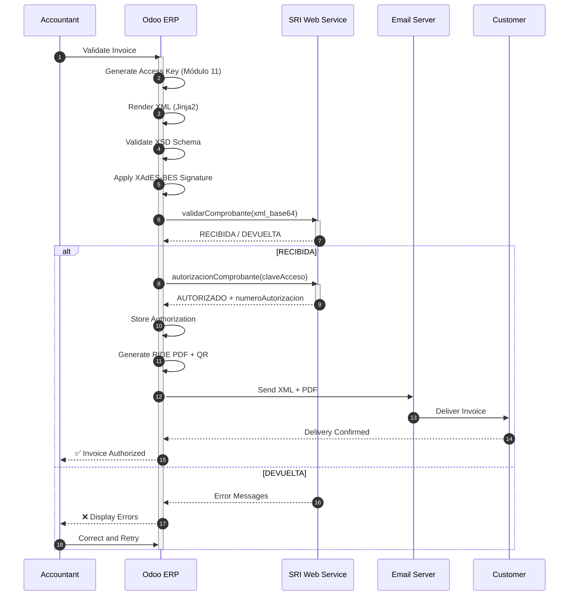
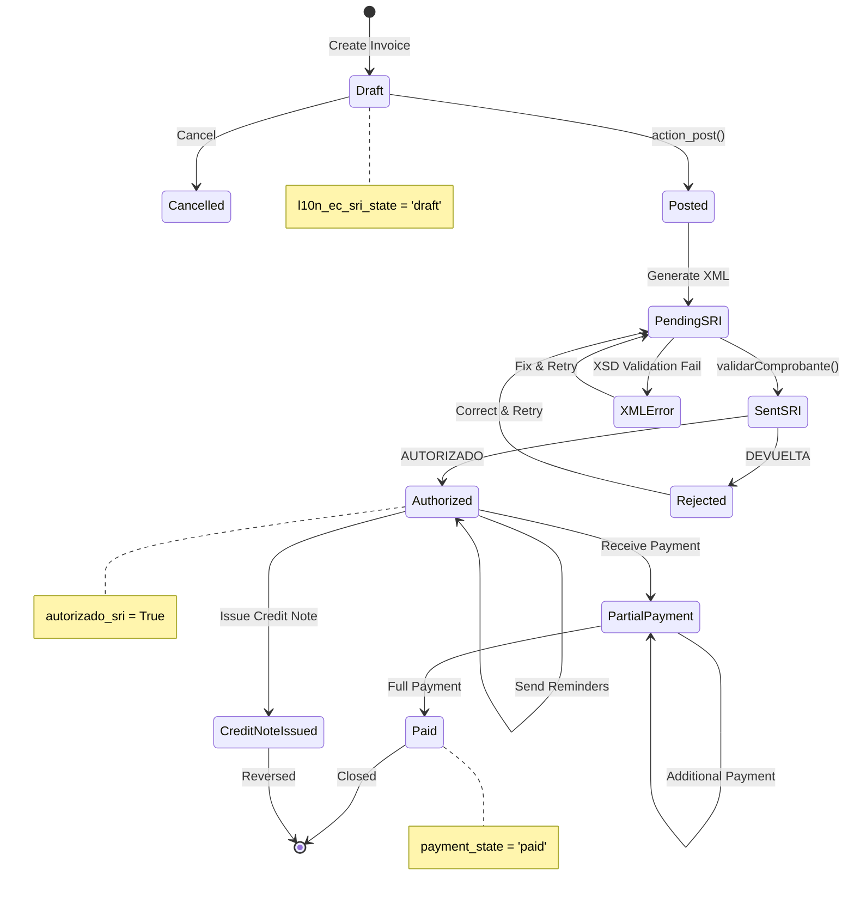
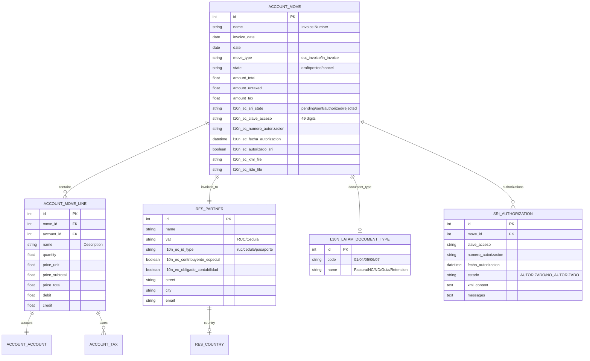
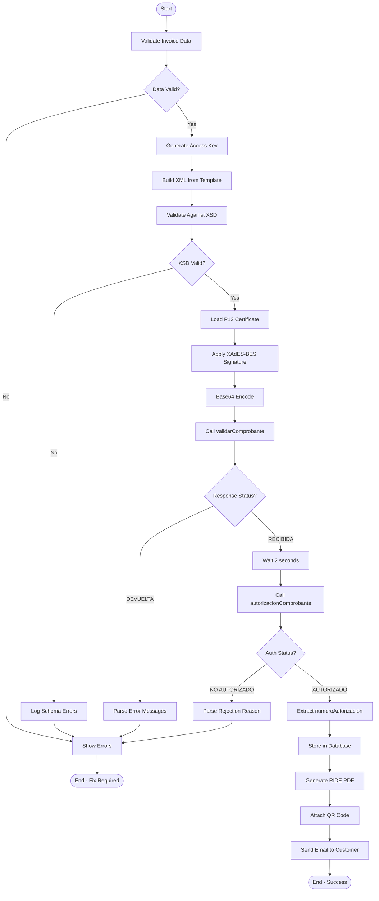
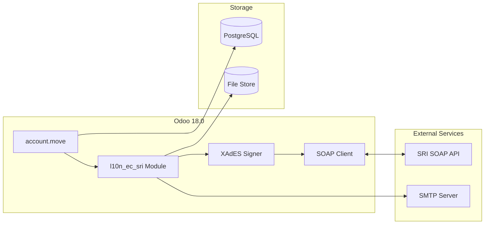

# UML DIAGRAMS: INVOICE-TO-CASH
## Appendix to PF_01 - Professional UML Suite

**Document ID**: PF-01-UML | **Version**: 1.0 | **Date**: 2026-01-22

---

## 1. SEQUENCE DIAGRAM: Electronic Invoice Flow

---

## 2. STATE MACHINE: Invoice Lifecycle

---

## 3. ER DIAGRAM: Invoice Data Model

---

## 4. ACTIVITY DIAGRAM: SRI Authorization Process

---

## 5. COMPONENT DIAGRAM: System Architecture

---

**UML Classification**: ISO 19501 / UML 2.5 Compliant
