# PROCESS FLOWS: PROCURE-TO-PAY (P2P)
## Purchase-to-Payment with Ecuador Withholding

**Document ID**: PF-P2P-001
**Version**: 1.0
**Classification**: Big 4 Professional Grade

---

## 1. END-TO-END PROCESS FLOW

```mermaid
flowchart TD
    subgraph PURCHASING["Purchasing Department"]
        A[Purchase Request] --> B[Create RFQ]
        B --> C[Vendor Selection]
        C --> D{New Vendor?}
        D -->|Yes| E[Create Vendor<br/>Validate RUC]
        D -->|No| F[Select Existing Vendor]
        E --> G[Vendor RUC Validation<br/>stdnum.ec.ruc]
        G -->|Invalid| H[Reject - Request Valid RUC]
        G -->|Valid| F
        F --> I[Create Purchase Order]
        I --> J[Submit for Approval]
        J --> K{Approved?}
        K -->|Yes| L[Confirm PO]
        K -->|No| M[Return to Requester]
    end

    subgraph WAREHOUSE["Warehouse / Receiving"]
        L --> N[Wait for Goods]
        N --> O[Receive Shipment]
        O --> P[Create Receipt]
        P --> Q[Validate Quantities]
        Q --> R{Match PO?}
        R -->|Yes| S[Validate Receipt]
        R -->|No| T[Discrepancy Resolution]
        T --> R
    end

    subgraph ACCOUNTING["Accounts Payable"]
        S --> U[Receive Vendor Invoice<br/>Physical or E-Invoice]
        U --> V[Create Vendor Bill<br/>in_invoice]
        V --> W[3-Way Match<br/>PO + Receipt + Invoice]
        W --> X{Match OK?}
        X -->|No| Y[Resolve Discrepancy]
        Y --> W
        X -->|Yes| Z[action_post<br/>Validate Bill]
    end

    subgraph WITHHOLDING["Withholding Process"]
        Z --> AA[Identify Applicable<br/>Withholdings]
        AA --> AB{IR Withholding<br/>Required?}
        AB -->|Yes| AC[Calculate IR Amount<br/>Per Tax Code 303-340]
        AB -->|No| AD[Skip IR]
        AC --> AE{IVA Withholding<br/>Required?}
        AD --> AE
        AE -->|Yes| AF[Calculate IVA Amount<br/>30%/70%/100%]
        AE -->|No| AG[Skip IVA Ret]
        AF --> AH[Create Retención]
        AG --> AH
        AH --> AI[Validate Retención Date]
        AI --> AJ{Within 5 Days<br/>of Invoice?}
        AJ -->|No| AK[❌ BLOCK<br/>5-Day Rule Violated]
        AJ -->|Yes| AL[Generate Retención XML]
        AL --> AM[XAdES Sign]
        AM --> AN[SRI Reception]
        AN --> AO{RECIBIDA?}
        AO -->|Yes| AP[SRI Authorization]
        AO -->|No| AQ[Parse Errors, Retry]
        AQ --> AL
        AP --> AR{AUTORIZADO?}
        AR -->|Yes| AS[Store Auth Number]
        AR -->|No| AQ
        AS --> AT[Create Ret. Journal Entry<br/>Debit A/P, Credit Ret. Payable]
    end

    subgraph PAYMENT["Treasury / Payments"]
        AT --> AU[Bill Ready for Payment]
        AU --> AV[Payment Run<br/>Weekly/Bi-weekly]
        AV --> AW[Create Payment<br/>Net of Retentions]
        AW --> AX[Bank Transfer/<br/>Check]
        AX --> AY[Reconcile Payment]
        AY --> AZ[Close Vendor Bill]
    end
```



---

## 2. DECISION POINT SPECIFICATIONS

### 2.1 DP-P2P-001: New Vendor Check
| Attribute | Specification |
|:----------|:--------------|
| **Decision** | Is this a new vendor? |
| **Input** | Vendor name, RUC |
| **Check** | Search `res.partner.vat` WHERE `supplier_rank > 0` |
| **Output** | Existing partner OR new vendor workflow |

### 2.2 DP-P2P-002: PO Approval
| Attribute | Specification |
|:----------|:--------------|
| **Decision** | Is PO approved per delegation matrix? |
| **Thresholds** | |
| | ≤$500: Auto-approve |
| | $501-$5,000: Manager |
| | $5,001-$25,000: Director |
| | >$25,000: CFO |
| **System** | `purchase.order.state = 'to approve'` |

### 2.3 DP-P2P-003: 3-Way Match
| Attribute | Specification |
|:----------|:--------------|
| **Decision** | Do PO, Receipt, and Invoice match? |
| **Tolerance** | Price: ±2%, Quantity: ±1 unit |
| **Check Fields** | `qty_received`, `qty_invoiced`, `price_unit` |
| **On Mismatch** | Route to AP supervisor for resolution |

### 2.4 DP-P2P-004: IR Withholding Required
| Attribute | Specification |
|:----------|:--------------|
| **Decision** | Must we withhold IR on this purchase? |
| **Rules** | |
| | - Vendor NOT Contribuyente Especial |
| | - Transaction NOT exempt per FP |
| | - Amount > $50 |
| **Tax Codes** | 303-340 (per LORTI) |

### 2.5 DP-P2P-005: 5-Day Rule Validation
| Attribute | Specification |
|:----------|:--------------|
| **Decision** | Is Retención within 5 days of invoice date? |
| **Legal Basis** | LORTI Art. 50 |
| **Calculation** | `retention.date - invoice.date_invoice <= 5 days` |
| **On Violation** | System blocks with `CODE_701` error |
| **Code Reference** | `withholding.py` lines 196-204 |

---

## 3. WITHHOLDING RATE MATRIX

### 3.1 Income Tax Withholding (Retención IR)
| Code | Rate | Applies To | Odoo Tax Template |
|:-----|:-----|:-----------|:------------------|
| 303 | 10% | Professional fees (abogados, médicos, etc.) | `ret_ir_303_10` |
| 304 | 8% | Services predominantly intellectual | `ret_ir_304_8` |
| 307 | 2% | Advertising, marketing | `ret_ir_307_2` |
| 309 | 1% | Private transport | `ret_ir_309_1` |
| 310 | 1.75% | Transfer of movable goods | `ret_ir_310_175` |
| 312 | 1.75% | Goods not produced by taxpayer | `ret_ir_312_175` |
| 320 | 2.75% | Real estate rental | `ret_ir_320_275` |
| 340 | 1% | Other 1% retentions | `ret_ir_340_1` |
| 341 | 2% | Other 2% retentions | `ret_ir_341_2` |

### 3.2 IVA Withholding (Retención IVA)
| Rate | Applies To | XML codigoRetencion |
|:-----|:-----------|:--------------------|
| 30% | Purchase of goods | 1 |
| 70% | Purchase of services | 2 |
| 100% | Professional fees, liquidación de compra | 3 |

---

## 4. ACTIVITY SPECIFICATIONS

### 4.1 ACT-P2P-001: Create Retención
| Attribute | Specification |
|:----------|:--------------|
| **Trigger** | Vendor bill posted with withholding taxes |
| **Model** | `account.retention` |
| **Required Fields** | `invoice_id`, `partner_id`, `date`, `tax_ids` |
| **Validation** | 5-day rule via `_check_date()` |
| **Output** | Draft retention linked to invoice |

### 4.2 ACT-P2P-002: Generate Retención XML
| Attribute | Specification |
|:----------|:--------------|
| **Template** | `templates/retencion.xml` (Jinja2) |
| **Schema** | `schemas/retencion.xsd` v2.0.0 |
| **Key Elements** | `infoTributaria`, `infoCompRetencion`, `docsSustento`, `impuestos` |
| **Access Key** | codDoc = '07' (Retención) |

### 4.3 ACT-P2P-003: Create Retention Journal Entry
| Attribute | Specification |
|:----------|:--------------|
| **Trigger** | Retention authorized by SRI |
| **Method** | `retention.create_move()` |
| **Debit** | Accounts Payable (reduce vendor liability) |
| **Credit** | Retention Payable (liability to SRI) |
| **Reconciliation** | Auto-reconcile with vendor bill |

---

## 5. JOURNAL ENTRY EXAMPLES

### 5.1 Vendor Bill ($1,000 + 15% IVA, 2% IR Ret, 30% IVA Ret)
```
# On Bill Post
Dr. 5.1.1.01 Compras                    $1,000.00
Dr. 1.1.5.01 IVA Crédito Tributario       $105.00  # $150 IVA - $45 Ret
    Cr. 2.1.1.01 Cuentas por Pagar       $1,085.00  # Net payable
    Cr. 2.1.7.02 Ret. Fuente por Pagar      $20.00  # 2% of $1,000
    Cr. 2.1.7.03 Ret. IVA por Pagar         $45.00  # 30% of $150

# Payment
Dr. 2.1.1.01 Cuentas por Pagar        $1,085.00
    Cr. 1.1.1.01 Bancos               $1,085.00
```

### 5.2 Retention Liability Settlement (Form 103)
```
Dr. 2.1.7.02 Ret. Fuente por Pagar       $XX.XX
Dr. 2.1.7.03 Ret. IVA por Pagar          $XX.XX
    Cr. 1.1.1.01 Bancos                  $XX.XX
```

---

## 6. RACI MATRIX

| Activity | Purchasing | Warehouse | AP | Treasury | IT |
|:---------|:-----------|:----------|:---|:---------|:---|
| Vendor Onboarding | **R/A** | I | C | I | I |
| Purchase Order | **R/A** | I | I | I | - |
| Goods Receipt | I | **R/A** | I | - | - |
| Invoice Entry | - | I | **R/A** | I | - |
| Withholding | - | - | **R** | **A** | I |
| SRI Transmission | - | - | **R** | - | **A** |
| Payment | - | - | C | **R/A** | - |

---

## 7. EXCEPTION HANDLING

### 7.1 EXH-P2P-001: 5-Day Rule Violation
| Attribute | Specification |
|:----------|:--------------|
| **Trigger** | `days.days not in range(1, 6)` |
| **Error Code** | `CODE_701` |
| **Message** | "La retención debe emitirse dentro de 5 días de la fecha de la factura" |
| **Resolution** | Cannot proceed - retention is legally void |
| **Escalation** | CFO, Legal for potential penalty assessment |

### 7.2 EXH-P2P-002: Contribuyente Especial Vendor
| Attribute | Specification |
|:----------|:--------------|
| **Trigger** | Vendor flagged as CE in `res.partner` |
| **Action** | Skip IR withholding, apply only IVA if applicable |
| **System Check** | `partner.l10n_ec_contribuyente_especial = True` |

---

## 8. METRICS & KPIs

| KPI | Target | Measurement | Alert Threshold |
|:----|:-------|:------------|:----------------|
| 3-Way Match Rate | ≥95% | Auto-matched ÷ Total | <90% |
| Retention Timeliness | 100% ≤5 days | On-time ÷ Total | Any late |
| Payment Cycle Time | ≤30 days | Invoice date → Payment | >45 days |
| Early Payment Discount Capture | ≥80% | Discounts taken ÷ Available | <60% |
| Duplicate Payment Rate | 0% | Duplicates ÷ Total | Any occurrence |

---

**Document Classification**: Process Flow Specification
**Owner**: Accounts Payable / Procurement
**Approval**: CFO, Procurement Director
**Last Updated**: 2026-01-22
