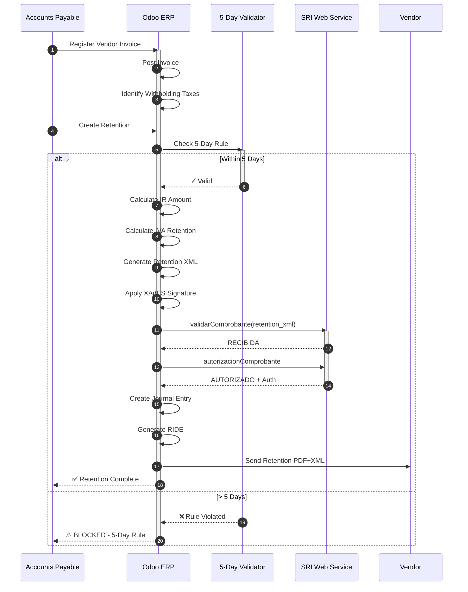
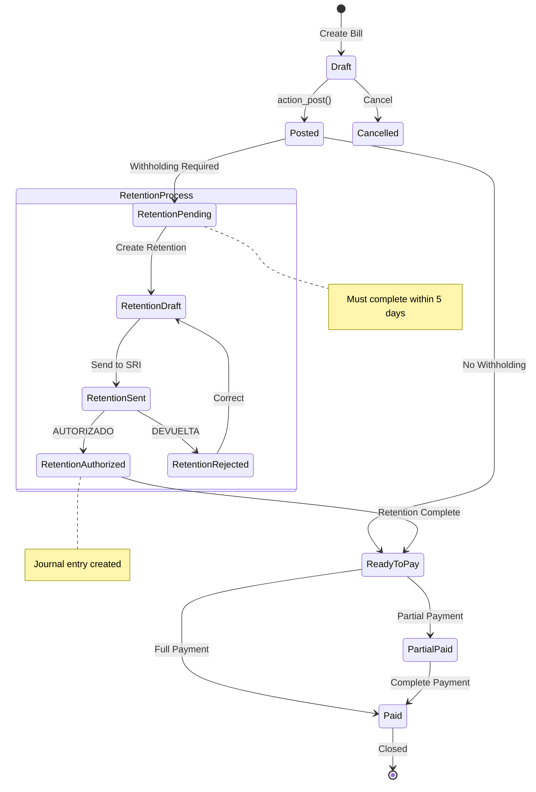
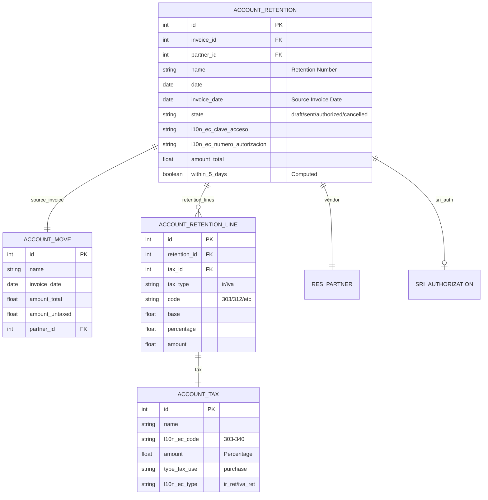
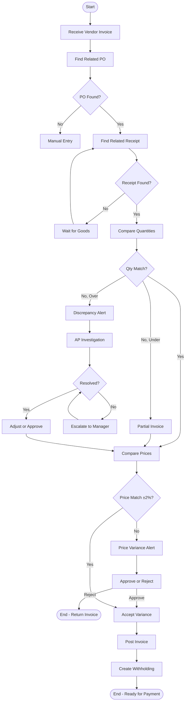
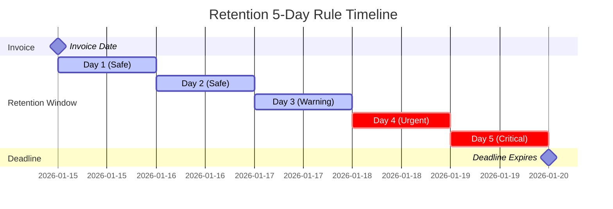
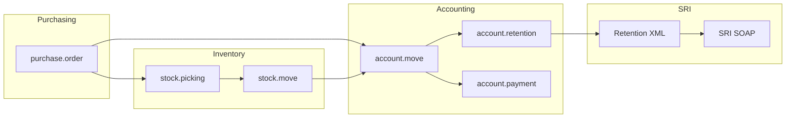

# UML DIAGRAMS: PROCURE-TO-PAY
## Appendix to PF_02 - Professional UML Suite

**Document ID**: PF-02-UML | **Version**: 1.0 | **Date**: 2026-01-22

---

## 1. SEQUENCE DIAGRAM: Withholding Flow

---

## 2. STATE MACHINE: Vendor Bill + Retention Lifecycle

---

## 3. ER DIAGRAM: Retention Data Model

---

## 4. ACTIVITY DIAGRAM: 3-Way Match Process

---

## 5. TIMING DIAGRAM: 5-Day Rule

---

## 6. COMPONENT DIAGRAM: P2P Integration

---

**UML Classification**: ISO 19501 / UML 2.5 Compliant
