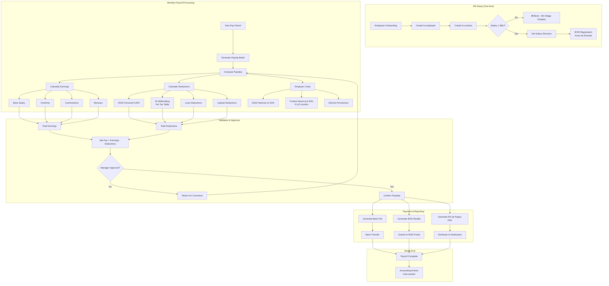

# PROCESS FLOW: PAYROLL CYCLE
## Monthly Payroll Processing with IESS and Décimos

**Document ID**: PF-PAYROLL-001
**Version**: 1.0
**Classification**: Big 4 Professional Grade

---

## 1. END-TO-END PAYROLL PROCESS



---

## 2. IESS CONTRIBUTION CALCULATION

### 2.1 Employee Contribution (Aporte Personal)
```
IESS Personal = Gross Salary × 9.45%
```

### 2.2 Employer Contribution (Aporte Patronal)
```
IESS Patronal = Gross Salary × 12.15%
```

### 2.3 Fondos de Reserva (After 13 months)
```
Fondos = Gross Salary × 8.33%
```

### 2.4 Contribution Ceiling
```
Max Base = 25 × SBU = 25 × $482 = $12,050
```

---

## 3. DÉCIMOS CALCULATION

### 3.1 Décimo Tercero (Monthly Provision)
```
Monthly Provision = Monthly Earnings ÷ 12
Period: Dec 1 (prior year) to Nov 30 (current year)
Payment: December 24
```

### 3.2 Décimo Cuarto (Monthly Provision)
```
Monthly Provision = SBU ÷ 12 = $482 ÷ 12 = $40.17
Period (Coast): Mar 1 to Feb 28/29
Period (Sierra): Aug 1 to Jul 31
Payment: Mar 15 (Coast) / Aug 15 (Sierra)
```

---

## 4. OVERTIME CALCULATION

### 4.1 Rates per Código del Trabajo
| Type | Rate | Hours |
|:-----|:-----|:------|
| Regular Overtime (daytime) | 50% extra | Mon-Fri after 8hrs |
| Night Overtime | 100% extra | 24:00 - 06:00 |
| Weekend/Holiday | 100% extra | Sat, Sun, Feriados |

### 4.2 Formula
```python
hourly_rate = monthly_salary / 240  # 8hrs × 30 days
overtime_day = hourly_rate × 1.50 × hours
overtime_night = hourly_rate × 2.00 × hours
```

---

## 5. INCOME TAX WITHHOLDING

### 5.1 Calculation Flow
```
1. Annual Projected Salary = Monthly × 12
2. Subtract: IESS Personal contributions
3. Subtract: Personal deductions (if filed 107-A)
4. Apply Tax Table brackets
5. Monthly Withholding = Annual Tax ÷ 12
```

### 5.2 2026 Tax Brackets (Verify with SRI)
| From | To | Fixed | Rate |
|:-----|:---|:------|:-----|
| $0 | $11,902 | $0 | 0% |
| $11,902 | $15,159 | $0 | 5% |
| $15,159 | $19,682 | $163 | 10% |
| ... | ... | ... | ... |

---

## 6. JOURNAL ENTRIES

### 6.1 Payroll Accrual (End of Month)
```
Dr. 5.1.2.01 Sueldos y Salarios           $X,XXX.XX
Dr. 5.1.2.02 Horas Extras                   $XXX.XX
Dr. 5.1.2.03 IESS Patronal                  $XXX.XX
Dr. 5.1.2.04 Fondos de Reserva              $XXX.XX
Dr. 5.1.2.05 Provisión Décimo 13            $XXX.XX
Dr. 5.1.2.06 Provisión Décimo 14            $XXX.XX
Dr. 5.1.2.07 Provisión Vacaciones           $XXX.XX
    Cr. 2.1.3.01 Sueldos por Pagar         $X,XXX.XX
    Cr. 2.1.3.02 IESS por Pagar             $XXX.XX
    Cr. 2.1.3.03 Ret. IR por Pagar          $XXX.XX
    Cr. 2.1.4.01 Provisión Décimo 13        $XXX.XX
    Cr. 2.1.4.02 Provisión Décimo 14        $XXX.XX
    Cr. 2.1.4.03 Provisión Vacaciones       $XXX.XX
```

### 6.2 Salary Payment
```
Dr. 2.1.3.01 Sueldos por Pagar           $X,XXX.XX
    Cr. 1.1.1.01 Bancos                  $X,XXX.XX
```

### 6.3 IESS Payment (Monthly)
```
Dr. 2.1.3.02 IESS por Pagar               $XXX.XX
    Cr. 1.1.1.01 Bancos                   $XXX.XX
```

---

## 7. DECISION POINTS

### 7.1 DP-PAY-001: Minimum Wage Check
| Attribute | Specification |
|:----------|:--------------|
| **Check** | contract.wage >= SBU |
| **Action if False** | Block contract save |
| **Message** | "Salario menor al SBU vigente ($482)" |

### 7.2 DP-PAY-002: Fondos de Reserva Eligibility
| Attribute | Specification |
|:----------|:--------------|
| **Check** | tenure >= 13 months |
| **Action if True** | Include 8.33% in calculations |
| **System Field** | `employee.service_months` |

### 7.3 DP-PAY-003: Overtime Authorization
| Attribute | Specification |
|:----------|:--------------|
| **Check** | Approved by manager |
| **Workflow** | hr.overtime → state='approved' |

---

## 8. RACI MATRIX

| Activity | HR | Manager | Accounting | Employee |
|:---------|:---|:--------|:-----------|:---------|
| Contract Setup | **R/A** | C | I | C |
| Attendance Input | C | **R** | I | **A** |
| Overtime Approval | I | **R/A** | I | C |
| Payslip Computation | **R** | I | C | I |
| Payslip Approval | C | **R/A** | C | I |
| Bank File Generation | **R** | I | **A** | I |
| IESS Submission | **R** | I | **A** | I |
| Payment Execution | I | I | **R/A** | I |

---

## 9. METRICS & KPIs

| KPI | Target | Measurement | Alert |
|:----|:-------|:------------|:------|
| Payroll on Time | 100% | Paid by 5th of month | Late |
| IESS Submission | 100% | By last day of month | Miss |
| Errors per Run | <1% | Corrections needed | >2% |
| Employee Queries | <5% | Post-payment questions | >10% |

---

**Document Classification**: Process Flow
**Owner**: HR / Payroll
**KB Reference**: KB_LABOR_SBU_DECIMOS, KB_IESS_CONTRIBUTIONS
**Last Updated**: 2026-01-22
