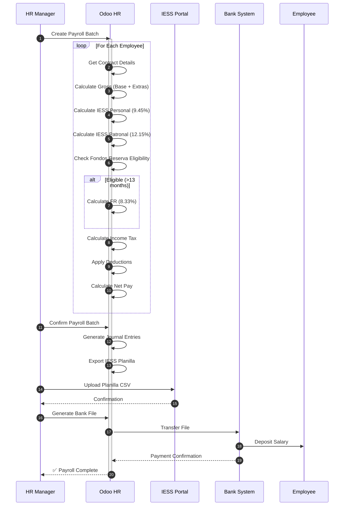
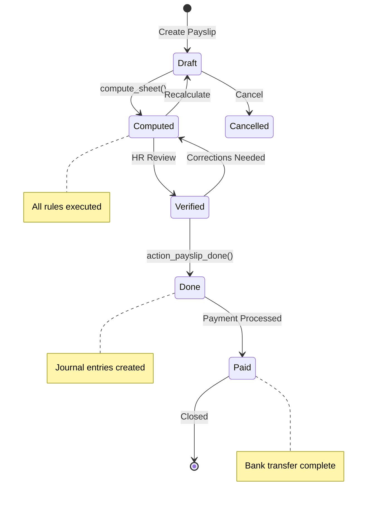
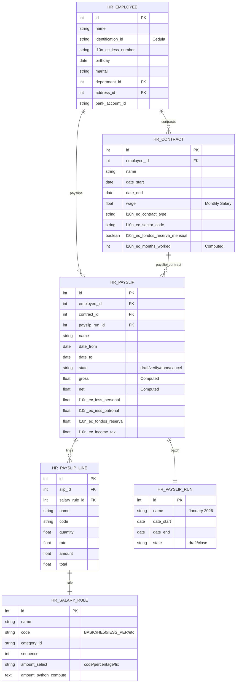
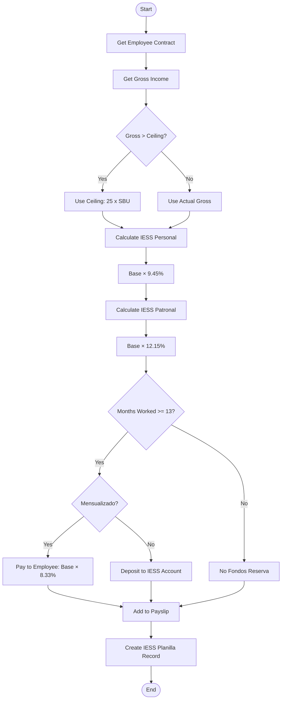
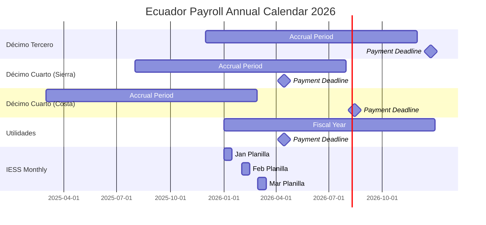
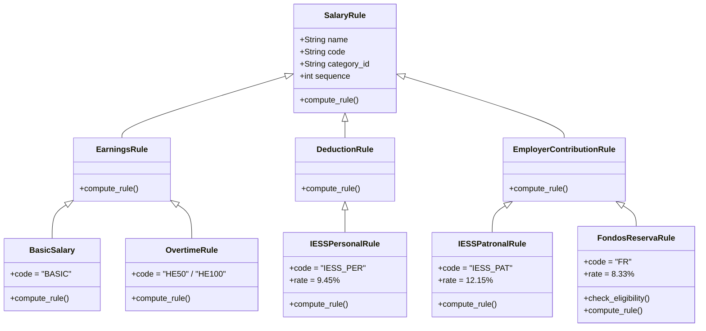

# UML DIAGRAMS: PAYROLL CYCLE
## Appendix to PF_03 - Professional UML Suite

**Document ID**: PF-03-UML | **Version**: 1.0 | **Date**: 2026-01-22

---

## 1. SEQUENCE DIAGRAM: Monthly Payroll Processing

---

## 2. STATE MACHINE: Payslip Lifecycle

---

## 3. ER DIAGRAM: Payroll Data Model

---

## 4. ACTIVITY DIAGRAM: IESS Contribution Calculation

---

## 5. TIMING DIAGRAM: Annual Benefits Calendar

---

## 6. CLASS DIAGRAM: Salary Rule Structure

---

**UML Classification**: ISO 19501 / UML 2.5 Compliant
