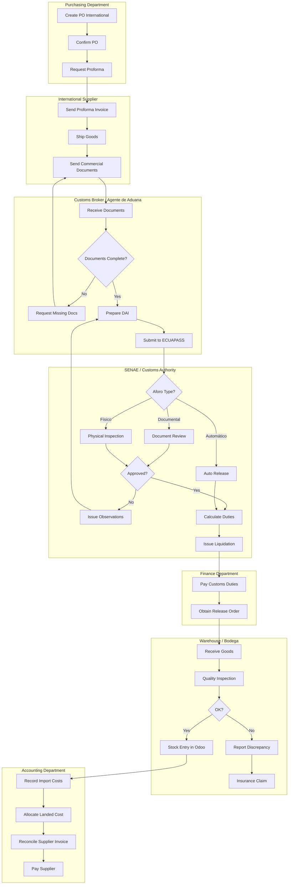

# PROCESS FLOW: CUSTOMS IMPORT (IMPORTACIÓN)
## PF_04 - Ecuador SENAE Compliance

**Document ID**: PF-004
**Version**: 1.0
**Effective Date**: 2026-01-22
**Owner**: Supply Chain Director (Expert Crew)
**Regulatory Reference**: [KB_SENAE_CUSTOMS.md](../11_regulatory_knowledge_base/KB_SENAE_CUSTOMS.md)

---

## 1. PROCESS OVERVIEW

Import process from international purchase order through customs clearance, tax payment, and inventory receipt in Odoo Ecuador.

---

## 2. SWIMLANE DIAGRAM



---

## 3. DECISION POINTS

| ID | Decision | Criteria | Yes Path | No Path |
|:---|:---------|:---------|:---------|:--------|
| DP-01 | Documents Complete? | BL, Commercial Invoice, Packing List, Origin Cert | Prepare DAI | Request Missing |
| DP-02 | Aforo Type? | Risk profile, product type, importer history | Auto/Doc/Physical | - |
| DP-03 | Customs Approved? | Document accuracy, valuation, classification | Calculate Duties | Issue Observations |
| DP-04 | Quality OK? | Inspect vs. PO specs | Stock Entry | Report Discrepancy |

---

## 4. TAX CALCULATIONS

### 4.1 Import Duty Formula

```
CIF Value = FOB + Freight + Insurance

Ad-Valorem Duty = CIF × Tariff Rate (varies by HS Code)
FODINFA = CIF × 0.5%
ICE (if applicable) = (CIF + Ad-Valorem + FODINFA) × ICE Rate
IVA = (CIF + Ad-Valorem + FODINFA + ICE) × 15%

Total Import Taxes = Ad-Valorem + FODINFA + ICE + IVA
```

### 4.2 Example Calculation

| Item | Value |
|:-----|:------|
| FOB Value | $10,000.00 |
| + Freight | $800.00 |
| + Insurance | $200.00 |
| **= CIF Value** | **$11,000.00** |
| Ad-Valorem (20%) | $2,200.00 |
| FODINFA (0.5%) | $55.00 |
| ICE (0%) | $0.00 |
| Base for IVA | $13,255.00 |
| **IVA (15%)** | **$1,988.25** |
| **TOTAL DUTIES** | **$4,243.25** |

---

## 5. REQUIRED DOCUMENTS

| Document | Source | Purpose |
|:---------|:-------|:--------|
| Commercial Invoice | Supplier | Valuation |
| Bill of Lading / AWB | Carrier | Transport proof |
| Packing List | Supplier | Content details |
| Certificate of Origin | Supplier/Chamber | Preferential tariffs |
| Proforma Invoice | Supplier | PO reference |
| Insurance Policy | Insurer | CIF calculation |
| INEN Certificates | Testing lab | Technical compliance |
| Phytosanitary (if food) | AGROCALIDAD | Health compliance |

---

## 6. ODOO CONFIGURATION

### 6.1 Purchase Order (International)

| Field | Configuration |
|:------|:--------------|
| Incoterm | FOB / CIF / EXW |
| Currency | Original (USD, EUR, CNY) |
| Fiscal Position | `Importación Ecuador` |
| Route | `Buy` + `Receive` |

### 6.2 Landed Cost Allocation

| Cost Type | Allocation Method |
|:----------|:------------------|
| Ad-Valorem | By Value |
| FODINFA | By Value |
| IVA | By Value |
| Freight | By Weight/Volume |
| Insurance | By Value |
| Customs Broker Fee | Equal |

---

## 7. JOURNAL ENTRIES

### 7.1 Record Import Taxes Paid

```
Date: [Duty Payment Date]
----------------------------------------------------------------
Account                              Debit       Credit
----------------------------------------------------------------
1.1.2.01 - IVA Pagado (Tax Credit)   1,988.25
1.1.5.01 - Import Duties Clearing    2,255.00
    1.1.1.02 - Bancos                            4,243.25
----------------------------------------------------------------
Ref: DAI #[number] - Import [PO Reference]
```

### 7.2 Goods Receipt with Landed Cost

```
Date: [Stock Receipt Date]
----------------------------------------------------------------
Account                              Debit       Credit
----------------------------------------------------------------
1.1.3.01 - Inventario Mercaderías   13,255.00
    2.1.1.05 - Cuentas por Pagar Ext.           11,000.00
    1.1.5.01 - Import Duties Clearing            2,255.00
----------------------------------------------------------------
Ref: Goods receipt [PO Reference]
```

---

## 8. RACI MATRIX

| Activity | Purchasing | Broker | Finance | Warehouse | Accounting |
|:---------|:-----------|:-------|:--------|:----------|:-----------|
| Create PO | R/A | I | C | I | I |
| Prepare DAI | C | R/A | I | I | I |
| Pay Duties | I | C | R/A | I | I |
| Receive Goods | I | I | I | R/A | I |
| Allocate Landed Cost | C | I | C | I | R/A |
| Pay Supplier | C | I | R/A | I | C |

---

## 9. KPIs

| Metric | Target | Measurement |
|:-------|:-------|:------------|
| Customs Clearance Time | ≤ 5 days | DAI submit to release |
| Duty Calculation Accuracy | 100% | Errors / Total imports |
| Document Completeness | 100% | First submission acceptance |
| Inventory Accuracy | 100% | Physical vs. System |

---

## 10. EXCEPTION HANDLING

| Exception | Procedure | Owner |
|:----------|:----------|:------|
| Missing Origin Certificate | Request from supplier or apply MFN rate | Purchasing |
| Aforo Físico observations | Coordinate with broker, provide evidence | Purchasing + Finance |
| Goods damage in transit | Insurance claim, partial receipt | Warehouse + Finance |
| HS Code dispute | Appeal with technical justification | Broker + Legal |

---

## 11. INTEGRATION POINTS

| System | Integration | Direction |
|:-------|:------------|:----------|
| ECUAPASS | DAI submission (future API) | Odoo → SENAE |
| Odoo Purchase | PO creation | Internal |
| Odoo Inventory | Stock receipt | Internal |
| Odoo Accounting | Landed cost, payments | Internal |
| Banking | Duty payment (SWIFT) | Odoo → Bank |

---

**Process Classification**: ISO 9001:2015 Controlled Process
