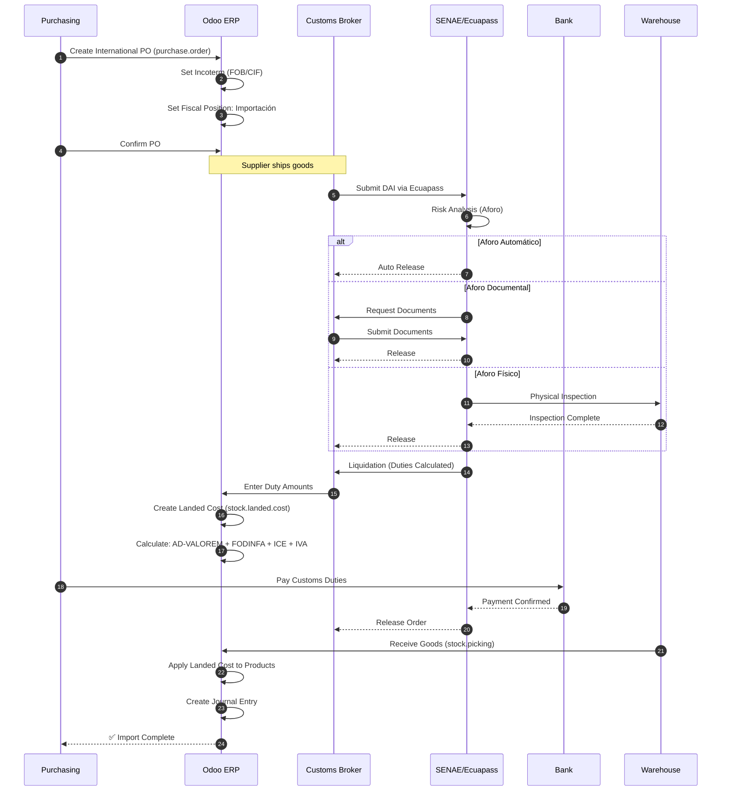
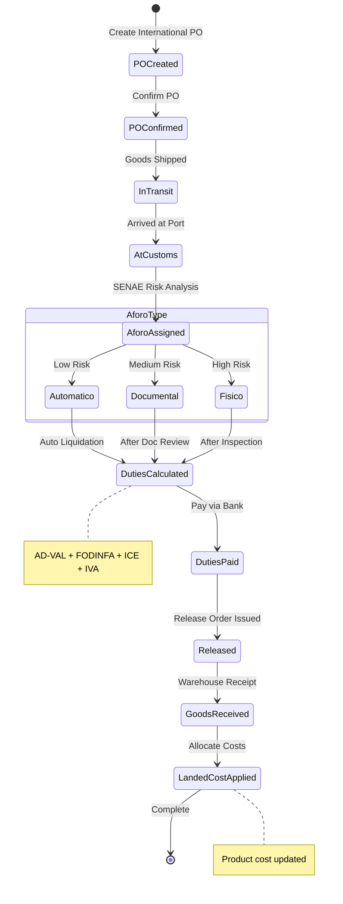
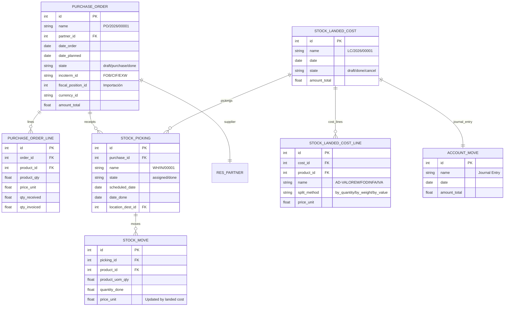
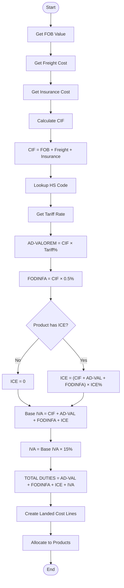
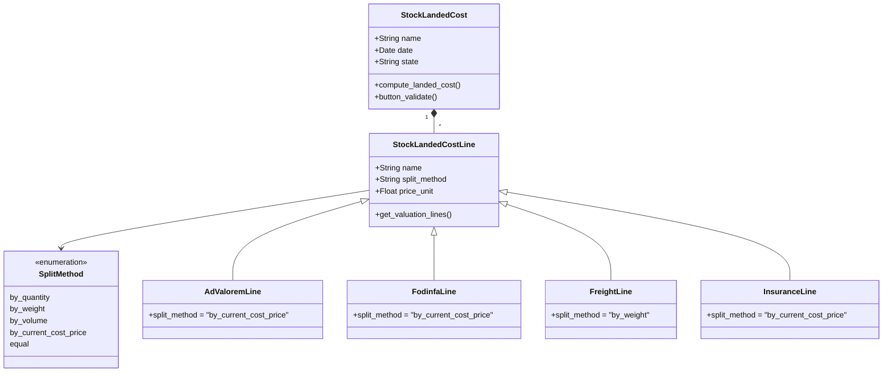

# UML DIAGRAMS: CUSTOMS IMPORT
## Appendix to PF_04 - Professional UML Suite

**Document ID**: PF-04-UML | **Version**: 1.0 | **Date**: 2026-01-22

---

## 1. SEQUENCE DIAGRAM: Import Process

---

## 2. STATE MACHINE: Import Document Lifecycle

---

## 3. ER DIAGRAM: Import Data Model (Odoo 18)

---

## 4. ACTIVITY DIAGRAM: Duty Calculation

---

## 5. CLASS DIAGRAM: Landed Cost Allocation

---

**UML Classification**: ISO 19501 / UML 2.5 Compliant
**Odoo Version**: 18.0 (Canonical Model Names)
