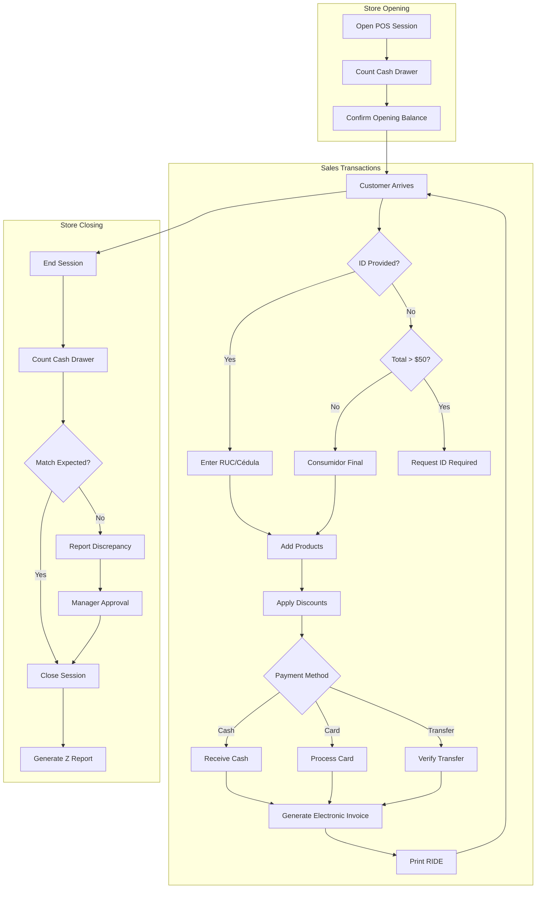

# PROCESS FLOW: POS DAILY OPERATIONS
## PF_05 - Point of Sale Ecuador Compliance

**Document ID**: PF-005 | **Version**: 1.0 | **Date**: 2026-01-22
**Owner**: Retail Operations Manager (Expert Crew)

---

## 1. SWIMLANE DIAGRAM

---

## 2. CONSUMIDOR FINAL RULES

| Total Venta | Requirement | Invoice Type |
|:------------|:------------|:-------------|
| ≤ $50.00 | No ID needed | Consumidor Final |
| > $50.00 | ID Required | Named invoice |

> [!WARNING]
> Sistema bloquea ventas > $50 sin identificación.

---

## 3. KPIs

| Metric | Target |
|:-------|:-------|
| Transaction Time | < 2 min |
| SRI Sync | < 30 sec |
| Daily Closure | 100% reconciled |

---

**Process Classification**: ISO 9001:2015 Controlled
