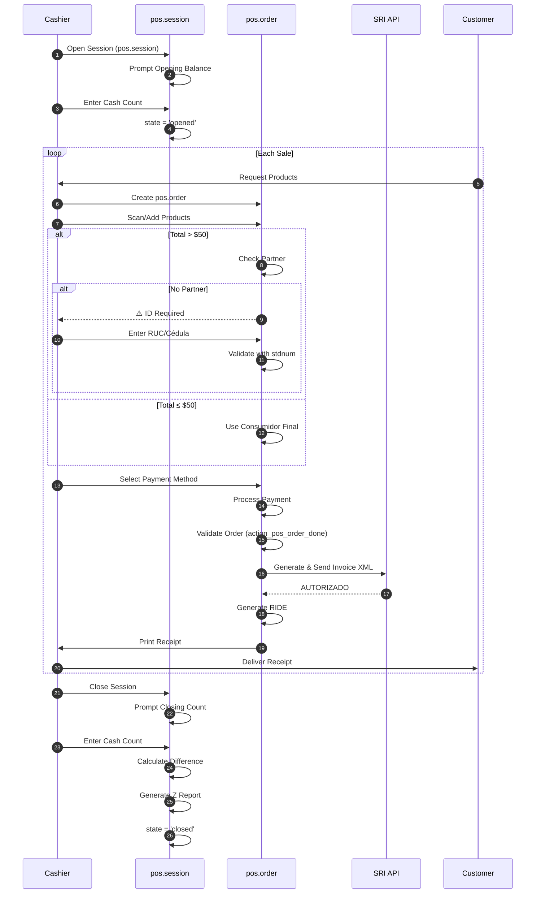
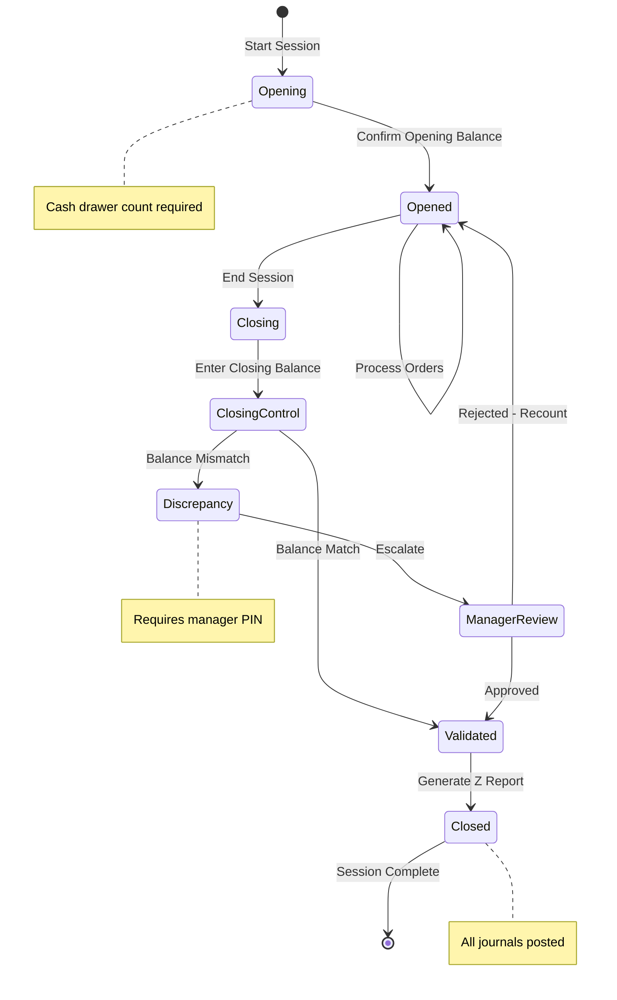
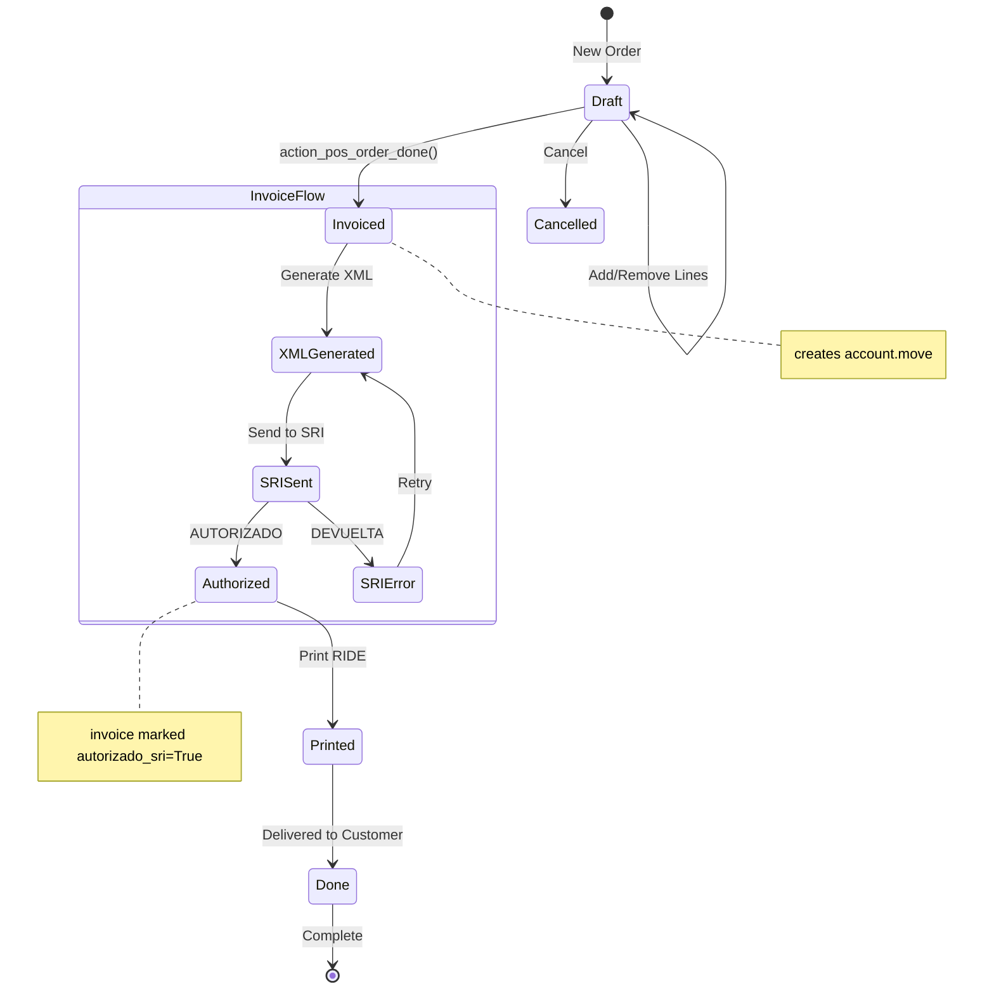
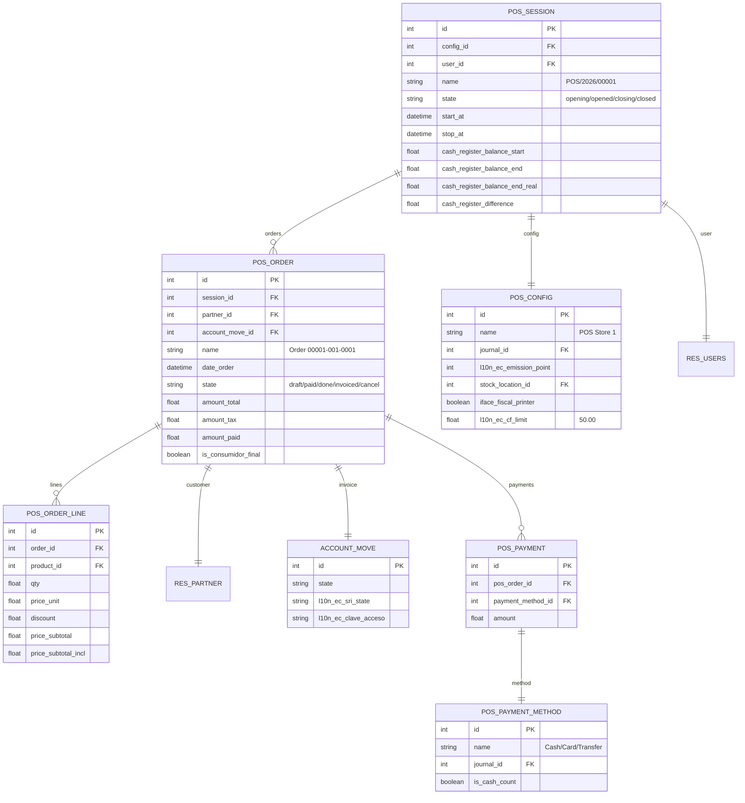

# UML DIAGRAMS: POS OPERATIONS
## Appendix to PF_05 - Professional UML Suite

**Document ID**: PF-05-UML | **Version**: 1.0 | **Date**: 2026-01-22

---

## 1. SEQUENCE DIAGRAM: POS Sale Transaction



---

## 2. STATE MACHINE: POS Session Lifecycle



---

## 3. STATE MACHINE: POS Order Lifecycle



---

## 4. ER DIAGRAM: POS Data Model (Odoo 18)



---

## 5. ACTIVITY DIAGRAM: Consumidor Final Check

```mermaid
flowchart TB
    A([Start Sale]) --> B[Add Products to Order]
    B --> C[Calculate Total]
    C --> D{Total > $50?}

    D -->|No| E[Use Consumidor Final]
    E --> F[Set partner = CF (9999999999999)]

    D -->|Yes| G{Partner Assigned?}
    G -->|Yes| H{Partner has valid RUC/CI?}
    H -->|Yes| I[Proceed with Partner]
    H -->|No| J[⚠️ Update Partner ID]

    G -->|No| K[Prompt: Enter RUC/Cédula]
    K --> L[Validate with stdnum]
    L --> M{Valid?}
    M -->|No| N[Show Error - Retry]
    N --> K
    M -->|Yes| O[Create/Select Partner]
    O --> I
    J --> L

    F --> P[Process Payment]
    I --> P

    P --> Q[Generate Invoice]
    Q --> R([End])
```

---

**UML Classification**: ISO 19501 / UML 2.5 Compliant
**Odoo Version**: 18.0 (Canonical Model Names)
