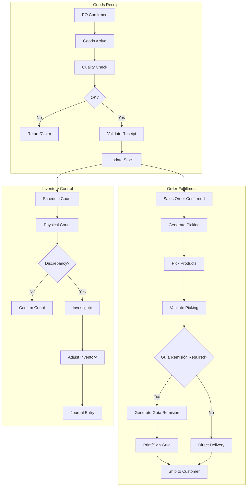

# PROCESS FLOW: INVENTORY CYCLE
## PF_06 - Stock Management Ecuador

**Document ID**: PF-006 | **Version**: 1.0 | **Date**: 2026-01-22
**Owner**: Warehouse Manager (Expert Crew)

---

## 1. SWIMLANE DIAGRAM



---

## 2. GUÍA DE REMISIÓN RULES

| Scenario | Required? |
|:---------|:----------|
| Sale with delivery | ✅ Always |
| Internal transfer | ✅ If different locations |
| Customer returns | ✅ Document required |

---

## 3. ACCOUNTING ENTRIES

```
Goods Receipt:
  Debit:  1.1.3.01 Inventario
  Credit: 2.1.1.01 Cuentas x Pagar

Inventory Adjustment (Shortage):
  Debit:  5.1.9.01 Pérdida Inventario
  Credit: 1.1.3.01 Inventario
```

---

**Process Classification**: ISO 9001:2015 Controlled
