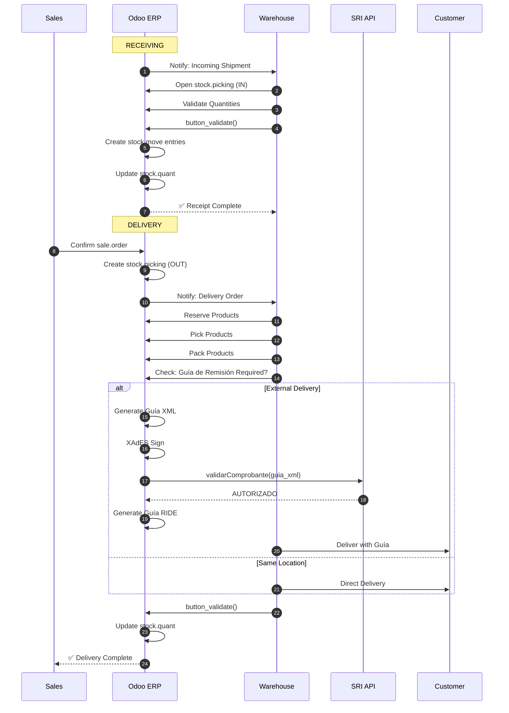
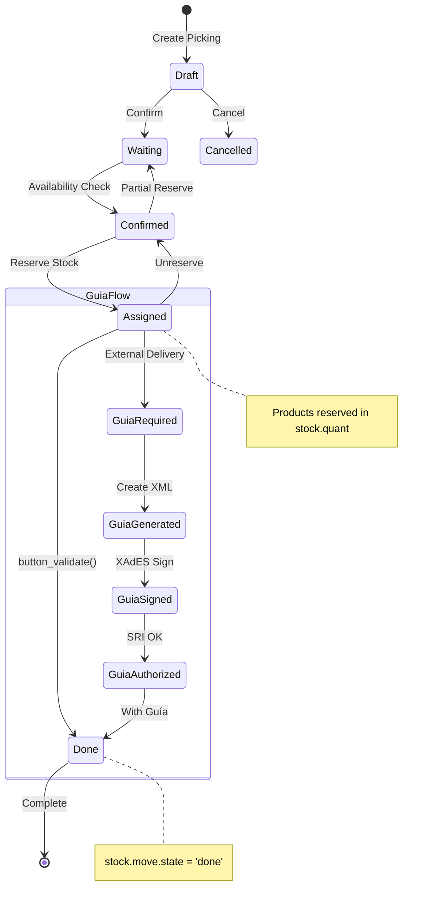
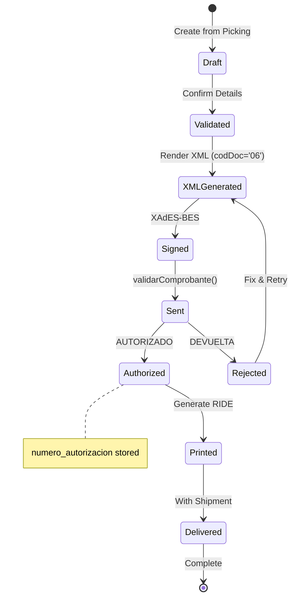
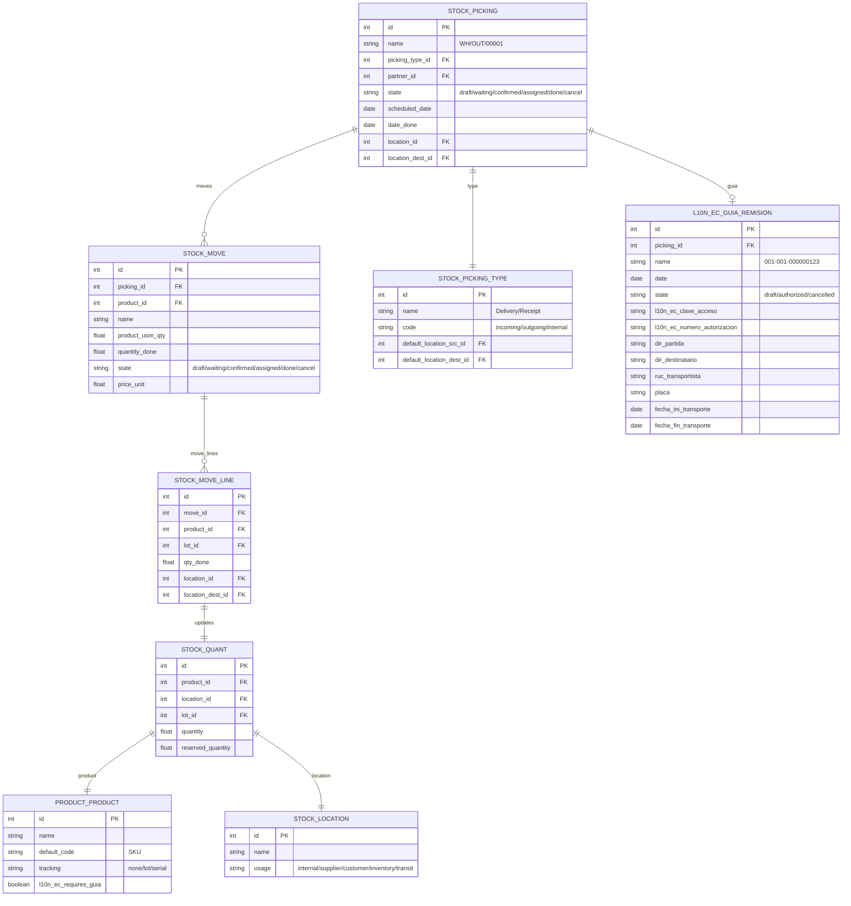
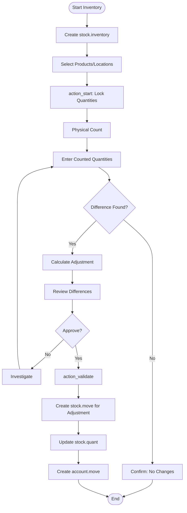
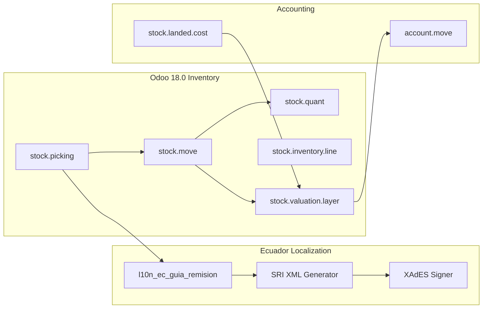

# UML DIAGRAMS: INVENTORY CYCLE
## Appendix to PF_06 - Professional UML Suite

**Document ID**: PF-06-UML | **Version**: 1.0 | **Date**: 2026-01-22

---

## 1. SEQUENCE DIAGRAM: Goods Receipt & Delivery

---

## 2. STATE MACHINE: stock.picking Lifecycle

---

## 3. STATE MACHINE: Guía de Remisión Lifecycle

---

## 4. ER DIAGRAM: Inventory Data Model (Odoo 18)

---

## 5. ACTIVITY DIAGRAM: Inventory Adjustment

---

## 6. COMPONENT DIAGRAM: Inventory System

---

**UML Classification**: ISO 19501 / UML 2.5 Compliant
**Odoo Version**: 18.0 (Canonical Model Names)
