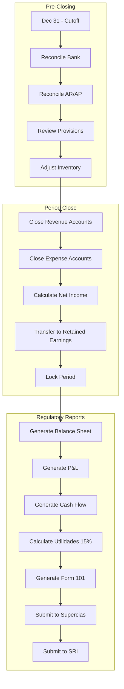

# PROCESS FLOW: ANNUAL CLOSING
## PF_07 - Cierre Fiscal Ecuador

**Document ID**: PF-007 | **Version**: 1.0 | **Date**: 2026-01-22
**Owner**: CFO (Expert Crew)

---

## 1. ANNUAL CLOSING CALENDAR

| Date | Activity | Owner |
|:-----|:---------|:------|
| Dec 31 | Close accounting period | Accounting |
| Jan 15 | IESS December planilla | HR |
| Feb 28 | Prepare financial statements | Accounting |
| Mar 31 | External audit (if required) | Auditor |
| Apr 15 | Décimo Cuarto (Sierra) | HR |
| Apr 15 | Utilidades payment | HR |
| Apr 30 | Submit to Supercias | Accounting |
| Apr (by RUC) | Form 101/102 | Tax |

---

## 2. SWIMLANE DIAGRAM



---

## 3. CLOSING ENTRIES

```
Close Revenue:
  Debit:  4.x.x.xx All Revenue Accounts
  Credit: 3.3.1.01 Resultado del Ejercicio

Close Expenses:
  Debit:  3.3.1.01 Resultado del Ejercicio
  Credit: 5.x.x.xx All Expense Accounts

Transfer to Retained Earnings:
  Debit:  3.3.1.01 Resultado del Ejercicio
  Credit: 3.2.1.01 Utilidades Retenidas
```

---

## 4. SUPERCIAS SUBMISSION

| Document | Format | Deadline |
|:---------|:-------|:---------|
| Balance General | XBRL | April 30 |
| Estado de Resultados | XBRL | April 30 |
| Estado Flujo Efectivo | XBRL | April 30 |
| Notas | PDF | April 30 |

---

**Process Classification**: ISO 9001:2015 Controlled
