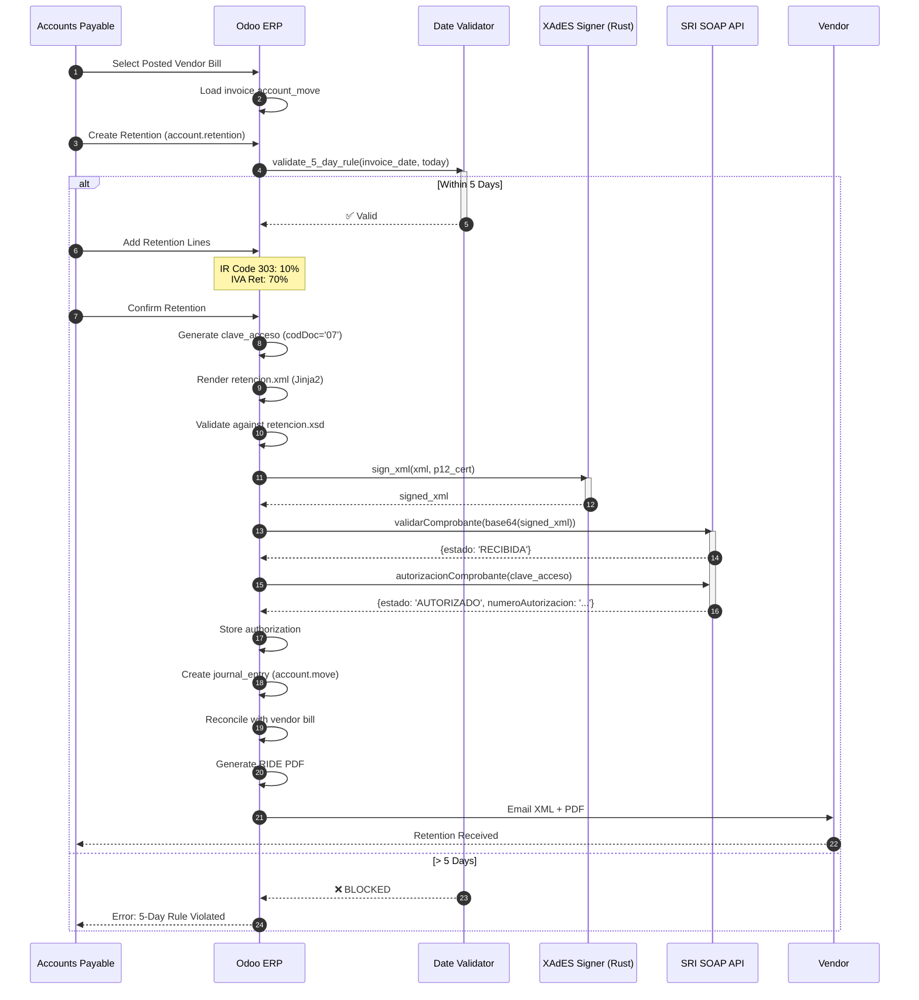
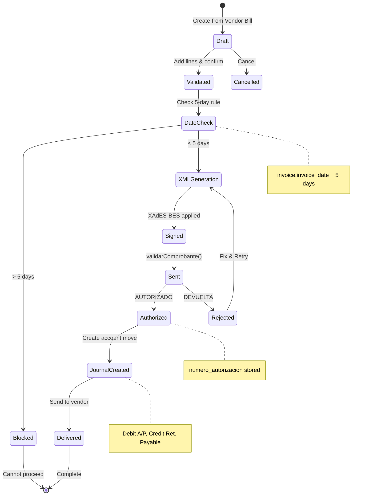
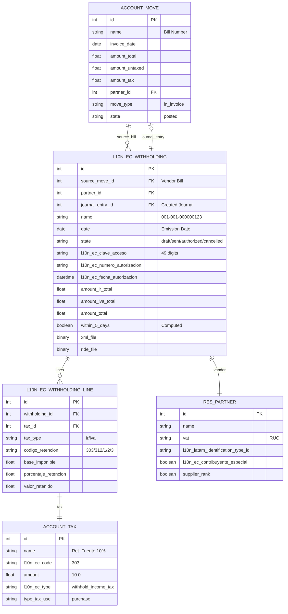
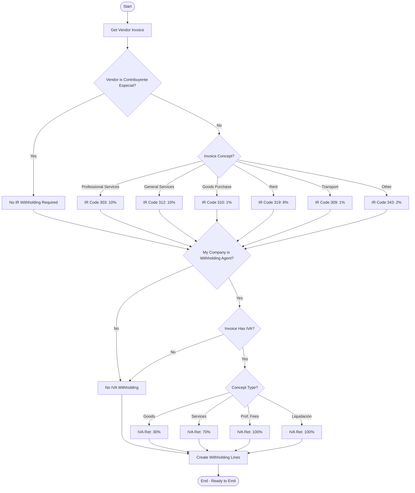
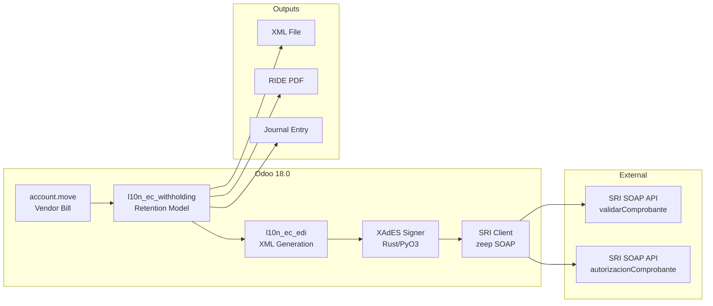
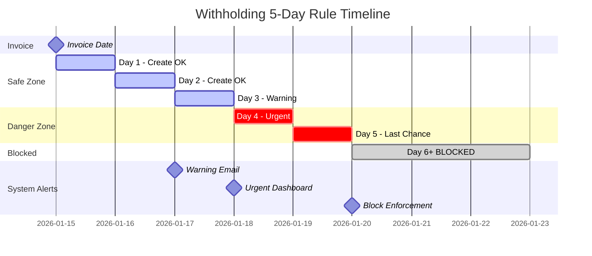

# UML DIAGRAMS: WITHHOLDING (RETENCIÓN)
## Appendix to PF_08 - Professional UML Suite

**Document ID**: PF-08-UML | **Version**: 1.0 | **Date**: 2026-01-22

---

## 1. SEQUENCE DIAGRAM: Withholding Authorization

---

## 2. STATE MACHINE: Retention Document Lifecycle

---

## 3. ER DIAGRAM: Retention Data Model (Odoo 18)

---

## 4. ACTIVITY DIAGRAM: Rate Determination

---

## 5. COMPONENT DIAGRAM: Withholding System

---

## 6. TIMING DIAGRAM: 5-Day Rule Enforcement

---

**UML Classification**: ISO 19501 / UML 2.5 Compliant
**Odoo Version**: 18.0 (Canonical Model Names)
