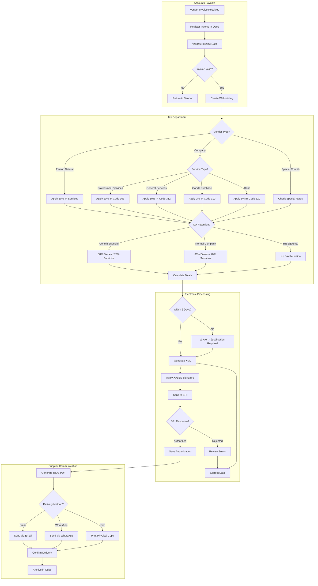

# PROCESS FLOW: WITHHOLDING (RETENCIÓN)
## PF_08 - Emisión de Comprobantes de Retención

**Document ID**: PF-008
**Version**: 1.0
**Effective Date**: 2026-01-22
**Owner**: Tax Manager (Expert Crew)
**Regulatory Reference**: [KB_TAX_RATES_WITHHOLDINGS.md](../11_regulatory_knowledge_base/KB_TAX_RATES_WITHHOLDINGS.md)

---

## 1. PROCESS OVERVIEW

Withholding (Retención) process from vendor invoice receipt through withholding emission, SRI authorization, and delivery to supplier.

> [!WARNING]
> **REGLA DE LOS 5 DÍAS**: La retención DEBE emitirse dentro de 5 días desde la fecha de la factura del proveedor.

---

## 2. SWIMLANE DIAGRAM



---

## 3. DECISION POINTS

| ID | Decision | Criteria | Yes Path | No Path |
|:---|:---------|:---------|:---------|:--------|
| DP-01 | Invoice Valid? | All fields complete, RUC valid | Create Withholding | Return to Vendor |
| DP-02 | Vendor Type? | RUC classification | Apply specific rates | - |
| DP-03 | IVA Retention? | Company is withholding agent | Apply IVA % | No IVA retention |
| DP-04 | Within 5 Days? | Invoice date + 5 | Normal flow | Justification alert |
| DP-05 | SRI Response? | Authorization code received | Save & proceed | Correct errors |

---

## 4. WITHHOLDING RATES MATRIX

### 4.1 Income Tax (IR) Withholding

| Code | Concept | Rate | Base |
|:-----|:--------|:-----|:-----|
| 303 | Honorarios profesionales | 10% | Total |
| 304 | Predomina intelecto | 8% | Total |
| 307 | Predomina mano de obra | 2% | Total |
| 308 | Entre sociedades | 0% | - |
| 309 | Publicidad y comunicación | 1% | Total |
| 310 | Transporte privado | 1% | Total |
| 312 | Transferencia bienes muebles | 1% | Total |
| 319 | Arrendamiento inmuebles | 8% | Total |
| 320 | Arrendamiento muebles | 1% | Total |
| 322 | Seguros y reaseguros | 1% | Total |
| 323 | Rendimientos financieros | 2% | Total |
| 332 | Pagos a no residentes | 25% | Total |
| 340 | Tarjetas de crédito | 0% | - |
| 343 | Otras retenciones | 2% | Total |

### 4.2 IVA Withholding

| Agent Type | Goods | Services |
|:-----------|:------|:---------|
| Contribuyente Especial | 30% | 70% |
| Sociedad | 30% | 70% |
| Persona Natural Obligada | 30% | 70% |
| Entidad Pública | 30% | 70% |
| Exportador | 100% | 100% |

---

## 5. 5-DAY RULE ENFORCEMENT

```python
def check_5_day_rule(invoice_date, withholding_date):
    """
    Validate 5-day emission rule per SRI regulation.
    """
    max_date = invoice_date + timedelta(days=5)

    if withholding_date > max_date:
        return {
            "status": "warning",
            "message": f"Retención fuera de plazo. Límite era {max_date}",
            "requires_justification": True
        }

    days_remaining = (max_date - date.today()).days
    if days_remaining <= 1:
        return {
            "status": "urgent",
            "message": f"⚠️ Quedan {days_remaining} días para emitir retención"
        }

    return {"status": "ok"}
```

---

## 6. JOURNAL ENTRIES

### 6.1 Vendor Invoice with Withholding

```
Date: [Invoice Registration Date]
----------------------------------------------------------------
Account                              Debit       Credit
----------------------------------------------------------------
5.1.1.01 - Gastos Servicios         1,000.00
1.1.2.01 - IVA Pagado                 150.00
    2.1.1.01 - Cuentas por Pagar               1,045.00
    2.1.4.01 - IR por Pagar (10%)                100.00
    2.1.4.02 - IVA por Pagar (70%)               105.00
----------------------------------------------------------------
Ref: Factura [001-001-000123] / Retención [001-001-000456]
```

### 6.2 Monthly Tax Payment

```
Date: [Tax Payment Date]
----------------------------------------------------------------
Account                              Debit       Credit
----------------------------------------------------------------
2.1.4.01 - IR por Pagar             2,500.00
2.1.4.02 - IVA Retenido por Pagar   1,800.00
    1.1.1.02 - Bancos                          4,300.00
----------------------------------------------------------------
Ref: Pago Form 103 / Form 104 Enero 2026
```

---

## 7. RACI MATRIX

| Activity | AP | Tax | Finance | IT |
|:---------|:---|:----|:--------|:---|
| Register Invoice | R/A | I | C | I |
| Create Withholding | C | R/A | I | I |
| Determine Rates | I | R/A | C | I |
| Sign & Send to SRI | I | R | I | A |
| Deliver to Vendor | R/A | I | I | I |
| Monthly Payment | I | C | R/A | I |

---

## 8. KPIs

| Metric | Target | Measurement |
|:-------|:-------|:------------|
| 5-Day Compliance | 100% | Within deadline |
| SRI Authorization Rate | 99% | First attempt |
| Delivery Confirmation | 100% | Vendor received |
| Error Rate | < 1% | Rejections / Total |

---

## 9. EXCEPTION HANDLING

| Exception | Procedure | Owner |
|:----------|:----------|:------|
| Invoice > 5 days old | Create with justification note | Tax |
| SRI Rejection | Review error, correct, resubmit | Tax |
| Vendor disputes rate | Verify with SRI table | Tax + Legal |
| Duplicate withholding | Void and recreate | Tax |
| Missing vendor RUC | Request from vendor | AP |

---

## 10. AI AGENT INTEGRATION

### Voice Commands

```
"Crear retención para factura de Proveedor ABC"
"¿Cuántas facturas tienen retención pendiente?"
"Mostrar facturas próximas a vencer el plazo de 5 días"
"Generar retención con 10% IR y 70% IVA"
```

### Automated Alerts

```
Day 3: "⚠️ Factura [XXX] de [Proveedor] tiene 2 días restantes para retención"
Day 4: "🔴 URGENTE: Factura [XXX] vence mañana - retención pendiente"
Day 5: "❌ CRÍTICO: Última oportunidad para emitir retención de [XXX]"
```

---

**Process Classification**: ISO 9001:2015 Controlled Process
