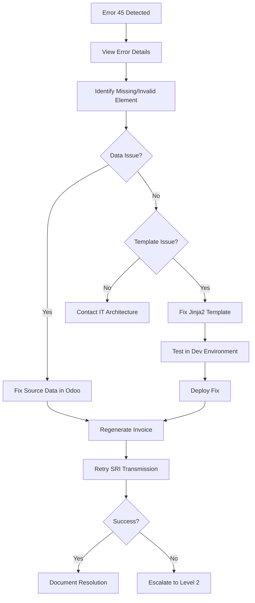
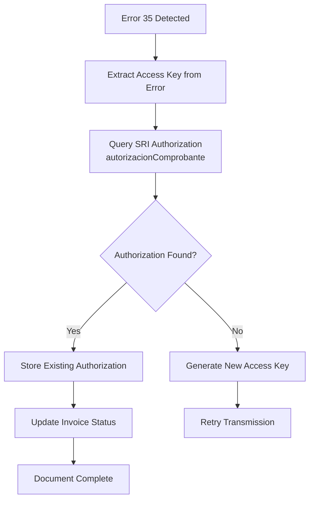
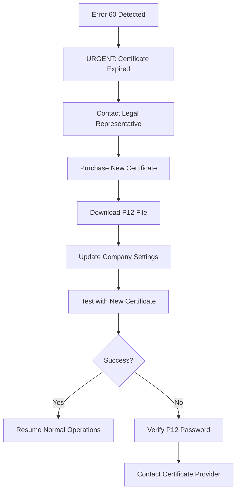

# ERROR HANDLING & RESOLUTION GUIDE
## SRI Error Codes and Resolution Procedures

**Document ID**: ERR-001
**Version**: 1.0
**Classification**: Big 4 Professional Grade

---

## 1. SRI ERROR CODE REFERENCE

### 1.1 Reception Errors (DEVUELTA)
| Error Code | Message | Cause | Resolution |
|:-----------|:--------|:------|:-----------|
| **21** | RUC INCORRECTO | Invalid company RUC | Verify RUC in company settings, check 13 digits |
| **22** | ESTABLECIMIENTO NO REGISTRADO | Establishment not in SRI | Register establishment at sri.gob.ec |
| **26** | PUNTO EMISION NO REGISTRADO | Emission point not registered | Register emission point at sri.gob.ec |
| **27** | CLAVE DE ACCESO EN USO | Access key already used | Check for duplicates, generate new key |
| **28** | FECHA EMISION EXTEMPORANEA | Emission date invalid | Date must match transmission date |
| **35** | DOCUMENTO DUPLICADO | Document already authorized | Use existing authorization |
| **43** | CLAVE ACCESO REGISTRADA | Key in system pending auth | Retrieve existing authorization |
| **45** | ERROR EN ESTRUCTURA XML | XML validation failed | Fix XML structure per XSD |
| **47** | FECHA EMISION INVALIDA | Date format wrong | Use DD/MM/YYYY format |
| **50** | ERROR SECUENCIAL | Sequential out of range | Check sequence configuration |
| **56** | ESTABLECIMIENTO NO EXISTE | Establishment not found | Verify establishment code |
| **65** | COMPROBANTE ANULADO | Document was voided | Cannot re-authorize voided document |
| **70** | CLAVE ACCESO REGISTRADA | Duplicate key | Retry with new access key |

### 1.2 Authorization Errors (NO AUTORIZADO)
| Error Code | Message | Cause | Resolution |
|:-----------|:--------|:------|:-----------|
| **39** | RUC EN LISTA NEGRA | RUC blacklisted | Contact SRI for clearance |
| **52** | CONTRIBUYENTE SUSPENDIDO | Taxpayer suspended | Regularize status with SRI |
| **53** | RUC PASIVO | RUC inactive | Reactivate RUC at SRI |
| **60** | CERTIFICADO FIRMA EXPIRADO | P12 expired | Renew electronic signature |
| **64** | CERTIFICADO REVOCADO | Certificate revoked | Obtain new certificate |

---

## 2. ERROR RESOLUTION WORKFLOWS

### 2.1 ERR-WF-001: Structure Error (Code 45)


### 2.2 ERR-WF-002: Duplicate Document (Code 35)


### 2.3 ERR-WF-003: Certificate Expired (Code 60)


---

## 3. ODOO-SPECIFIC ERRORS

### 3.1 Application Errors
| Error | Cause | Resolution |
|:------|:------|:-----------|
| `ValidationError: CODE_701` | 5-day rule violation | Retention must be within 5 days of invoice |
| `ValidationError: RUC must be 13 digits` | Invalid RUC length | Correct partner RUC |
| `ValidationError: DNI must be 10 digits` | Invalid Cédula length | Correct partner Cédula |
| `UserError: UAFE Limit Exceeded` | CF > $50 | Require customer identification |
| `ConnectionError: SRI Timeout` | Network issue | Retry, check connectivity |

### 3.2 Database Errors
| Error | Cause | Resolution |
|:------|:------|:-----------|
| `UniqueViolation: clave_acceso` | Duplicate access key | Regenerate access key |
| `IntegrityError: account_move` | Missing required field | Complete all required fields |

---

## 4. ESCALATION PROCEDURES

### 4.1 Level 1: User Self-Service
| Error Type | Max Duration | Actions |
|:-----------|:-------------|:--------|
| Data entry errors | 15 min | Fix data, retry |
| Validation errors | 15 min | Correct per message |
| Connectivity issues | 30 min | Wait, retry |

### 4.2 Level 2: IT Support
| Error Type | Max Duration | Actions |
|:-----------|:-------------|:--------|
| Repeated SRI errors | 2 hours | Investigate logs |
| XML structure issues | 4 hours | Debug template |
| Performance issues | 4 hours | Check resources |

### 4.3 Level 3: Vendor/SRI
| Error Type | Actions | Contact |
|:-----------|:--------|:--------|
| SRI system down | Monitor status | sri.gob.ec |
| Certificate issues | Contact provider | Security Data, ANF |
| Unknown error codes | Contact SRI | SRI support line |

---

## 5. MONITORING & ALERTING

### 5.1 Error Thresholds
| Metric | Warning | Critical | Action |
|:-------|:--------|:---------|:-------|
| SRI failure rate | >5%/hour | >10%/hour | Alert IT |
| Pending authorizations | >10 | >50 | Investigate |
| Certificate expiry | 30 days | 7 days | Urgent renewal |
| 5-day violations | 1/week | 1/day | Process review |

### 5.2 Automated Alerts
```python
# Cron job: Check for SRI errors
def check_sri_errors(self):
    errors = self.env['account.move'].search([
        ('autorizado_sri', '=', False),
        ('state', '=', 'posted'),
        ('create_date', '>=', fields.Date.today())
    ])
    if len(errors) > 10:
        self.send_alert('SRI Error Rate Critical', errors)
```

---

## 6. ERROR LOGGING

### 6.1 Log Format
```
[2026-01-22 10:30:45] [ERROR] [SRI] Invoice INV/2026/0001
  Access Key: 2201202601179123456700120010010000000011234567811
  Error Code: 45
  Message: ERROR EN ESTRUCTURA XML
  Details: Element 'fechaEmision' invalid format
  User: admin
  Retry Count: 1
```

### 6.2 Log Retention
| Log Type | Retention | Location |
|:---------|:----------|:---------|
| SRI transmission logs | 7 years | Database |
| Error details | 1 year | Log files |
| User actions | 1 year | Database |

---

## 7. RECOVERY PROCEDURES

### 7.1 Bulk Error Recovery
| Step | Action | Command/Path |
|:-----|:-------|:-------------|
| 1 | Identify failed invoices | `account.move.search([('autorizado_sri', '=', False)])` |
| 2 | Export list | Accounting → Reports → Pending Auth |
| 3 | Fix common issues | Batch update via scheduled action |
| 4 | Retry transmission | "Retry All Failed" button |
| 5 | Verify results | Check authorization status |

### 7.2 Manual Recovery
| Step | Action |
|:-----|:-------|
| 1 | Open failed invoice |
| 2 | View error message in chatter |
| 3 | Fix identified issue |
| 4 | Click "Retry SRI" |
| 5 | Verify authorization received |

---

**Document Classification**: Error Handling Guide
**Owner**: IT Support / Operations
**Last Updated**: 2026-01-22
