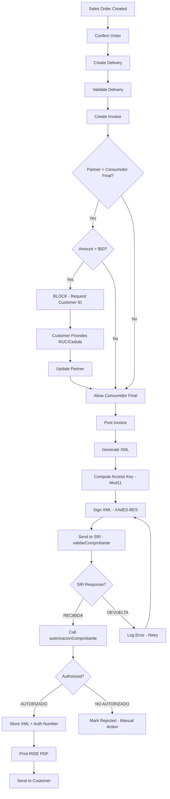
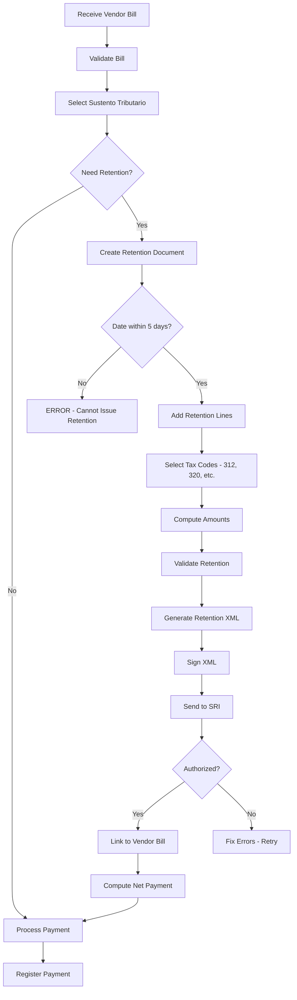
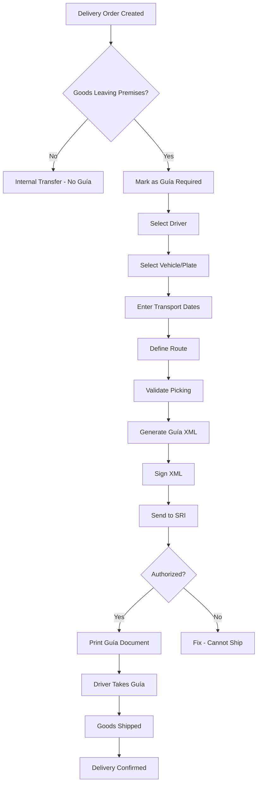
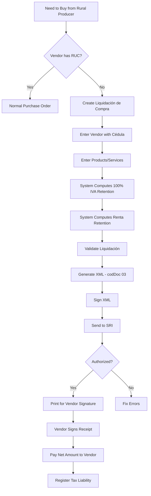
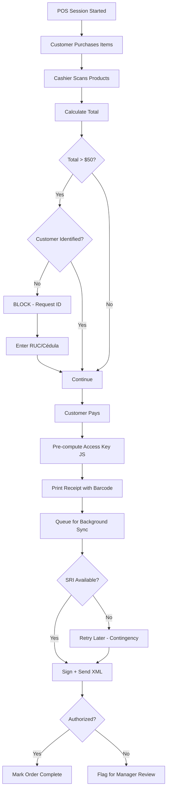
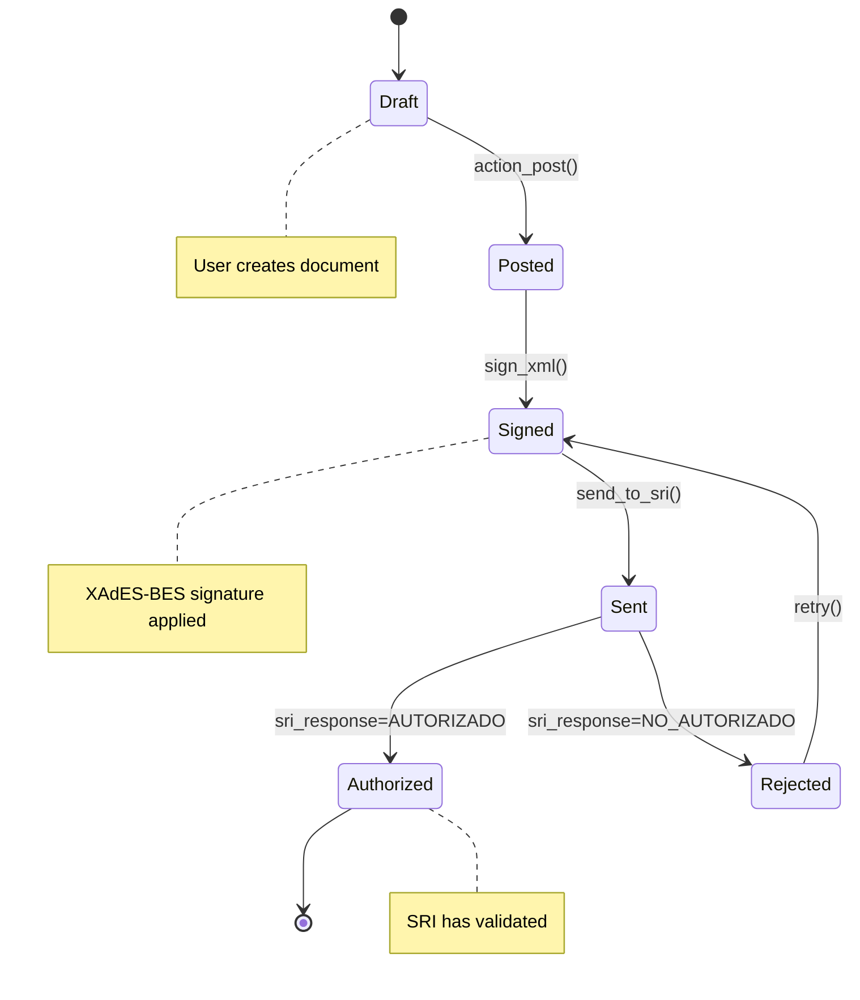
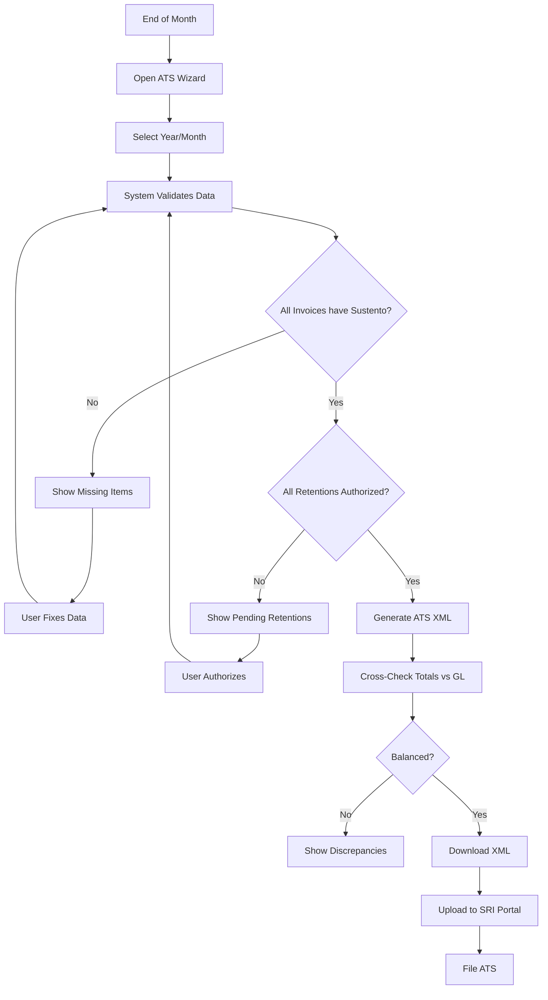
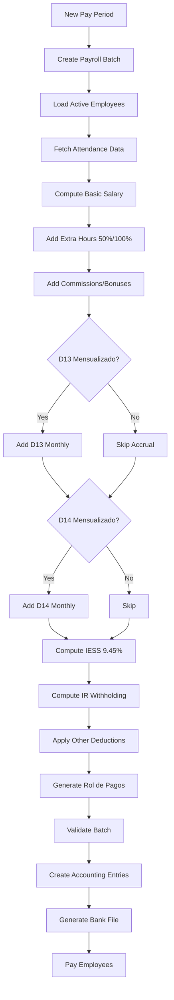
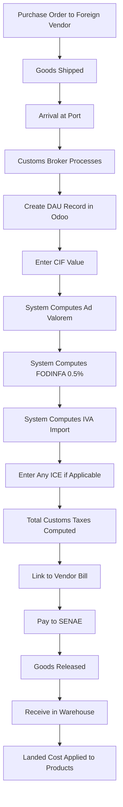
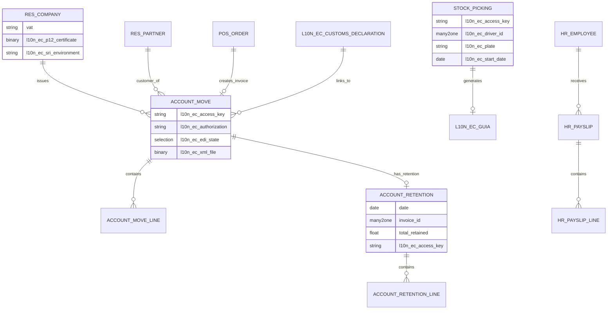

# BUSINESS PROCESS FLOWS & DIAGRAMS
## Ecuador Odoo 18.0 Localization

**Document ID**: SOMA-BPF-001
**Date**: 2026-01-22

---

## 1. ELECTRONIC INVOICE FLOW (Order-to-Cash)

---

## 2. WITHHOLDING (RETENCIÓN) FLOW

---

## 3. GUÍA DE REMISIÓN FLOW (Logistics)

---

## 4. PURCHASE LIQUIDATION FLOW

---

## 5. POS ELECTRONIC INVOICE FLOW

---

## 6. DOCUMENT STATE MACHINE

---

## 7. ATS GENERATION FLOW

---

## 8. PAYROLL FLOW

---

## 9. IMPORT (CUSTOMS) FLOW

---

## 10. ENTITY RELATIONSHIP DIAGRAM

---

**This is what a professional ERP implementor delivers.**
**Flow charts. State machines. ERDs. Real documentation.**
