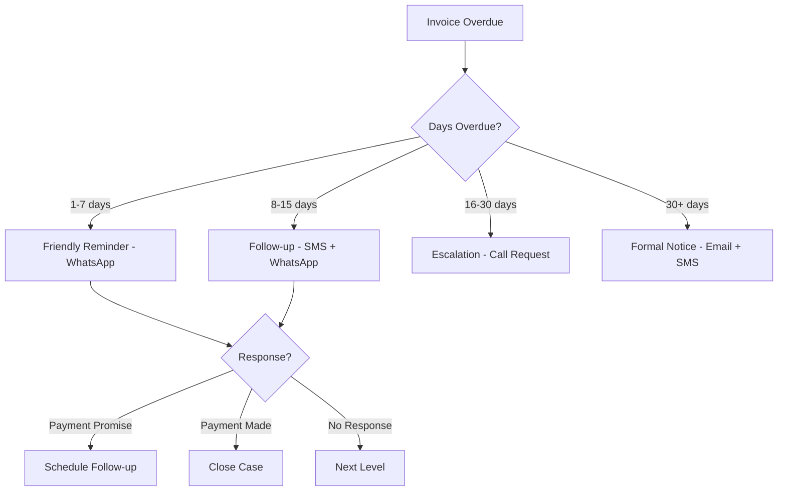

# AI AGENT: SMS/WHATSAPP INTEGRATION
## AI_05 - Intelligent Communication Channels

**Document ID**: AI-005 | **Version**: 1.0 | **Date**: 2026-01-22
**Owner**: AI Architect (Expert Crew)

---

## 1. OVERVIEW

AI-powered communication via WhatsApp Business API and SMS for customer engagement, collection, and notifications.

---

## 2. WHATSAPP BUSINESS API

### 2.1 Integration Architecture

```
┌─────────────┐    ┌──────────────┐    ┌─────────────┐
│   Odoo      │───▶│  Django MCP  │───▶│  Meta API   │
│   Invoice   │    │   AI Agent   │    │  WhatsApp   │
└─────────────┘    └──────────────┘    └─────────────┘
                          │
                          ▼
                   ┌──────────────┐
                   │   Customer   │
                   │   WhatsApp   │
                   └──────────────┘
```

### 2.2 Message Templates (Pre-approved)

#### Invoice Sent

```
Hola {{1}},

Su factura electrónica {{2}} por ${{3}} ha sido emitida.

📄 Descargar RIDE: {{4}}
📅 Vence: {{5}}

Gracias por su preferencia.
{{6}}
```

#### Payment Reminder

```
Hola {{1}},

Recordatorio amable: Su factura {{2}} por ${{3}} vence el {{4}}.

💳 Pagar ahora: {{5}}

¿Tiene alguna pregunta? Responda a este mensaje.
```

#### Overdue Notice

```
Estimado {{1}},

Su factura {{2}} por ${{3}} está vencida desde {{4}}.

Por favor realice el pago a la brevedad para evitar intereses.

📞 Contacto: {{5}}
```

### 2.3 AI Response Handling

```python
@mcp.tool("whatsapp/handle_response")
async def handle_whatsapp_response(
    phone: str,
    message: str,
    context: dict
) -> dict:
    """
    AI processes incoming WhatsApp messages.
    """
    # Identify intent
    intent = await ai.classify_intent(message)

    if intent == "payment_confirmation":
        # Mark invoice paid
        return await confirm_payment(context['invoice_id'])

    elif intent == "payment_plan_request":
        # Offer payment plan
        return await offer_payment_plan(context['partner_id'])

    elif intent == "dispute":
        # Escalate to human
        return await escalate_to_support(context)

    else:
        # General AI response
        return await ai.generate_response(message, context)
```

---

## 3. SMS INTEGRATION (TWILIO)

### 3.1 Use Cases

| Trigger | Message |
|:--------|:--------|
| Invoice Authorized | "Factura #001-001-000123 emitida por $500.00" |
| 3 Days Before Due | "Recordatorio: F-123 vence en 3 días" |
| Overdue | "F-123 está vencida. Pague hoy." |
| Payment Received | "Pago de $500 recibido. Gracias!" |

### 3.2 SMS Tool

```python
@mcp.tool("sms/send")
async def send_sms(
    phone: str,
    message: str,
    priority: str = "normal"
) -> dict:
    """
    Send SMS via Twilio.
    Max 160 characters.
    """
    # Validate phone format
    phone = normalize_ec_phone(phone)  # +593...

    # Send via Twilio
    result = await twilio.messages.create(
        to=phone,
        from_=settings.TWILIO_NUMBER,
        body=message[:160]
    )

    return {"sid": result.sid, "status": result.status}
```

---

## 4. AI COLLECTION AGENT

### 4.1 Workflow



### 4.2 Collection Tool

```python
@mcp.tool("collection/initiate")
async def initiate_collection(
    partner_id: int,
    strategy: str = "gentle"
) -> dict:
    """
    Start AI collection sequence.

    Strategies:
    - gentle: Friendly reminders only
    - normal: Escalating sequence
    - aggressive: Formal notices
    """
    overdue = await get_overdue_invoices(partner_id)

    for invoice in overdue:
        await schedule_collection_message(
            invoice_id=invoice.id,
            channel="whatsapp",
            template="payment_reminder",
            delay_hours=0
        )

    return {"invoices": len(overdue), "status": "initiated"}
```

---

## 5. NOTIFICATION PREFERENCES

### 5.1 Partner Settings

| Field | Options |
|:------|:--------|
| `notify_whatsapp` | Boolean |
| `notify_sms` | Boolean |
| `notify_email` | Boolean |
| `preferred_channel` | whatsapp/sms/email |
| `quiet_hours` | 22:00-08:00 |

### 5.2 Opt-Out Handling

```python
async def handle_optout(phone: str, channel: str):
    """
    Handle STOP/UNSUBSCRIBE messages.
    """
    partner = await find_partner_by_phone(phone)

    if channel == "whatsapp":
        partner.notify_whatsapp = False
    elif channel == "sms":
        partner.notify_sms = False

    await partner.save()

    # Confirm opt-out
    await send_message(
        phone,
        "Ha sido removido de notificaciones. Gracias."
    )
```

---

## 6. SECURITY & COMPLIANCE

### 6.1 Data Protection

- All messages logged in Odoo
- Phone numbers encrypted at rest
- No sensitive data in SMS (amounts only)
- GDPR/LOPDP compliant opt-out

### 6.2 Rate Limits

| Channel | Limit |
|:--------|:------|
| WhatsApp | 1000/day per number |
| SMS | 500/day total |
| Per Customer | Max 3/week |

---

## 7. MONITORING

### 7.1 Dashboard Metrics

| Metric | Target |
|:-------|:-------|
| Delivery Rate | > 95% |
| Response Rate | > 30% |
| Collection Success | > 60% |
| Opt-Out Rate | < 2% |

---

**AI Integration Classification**: ISO 9001:2015 Controlled
