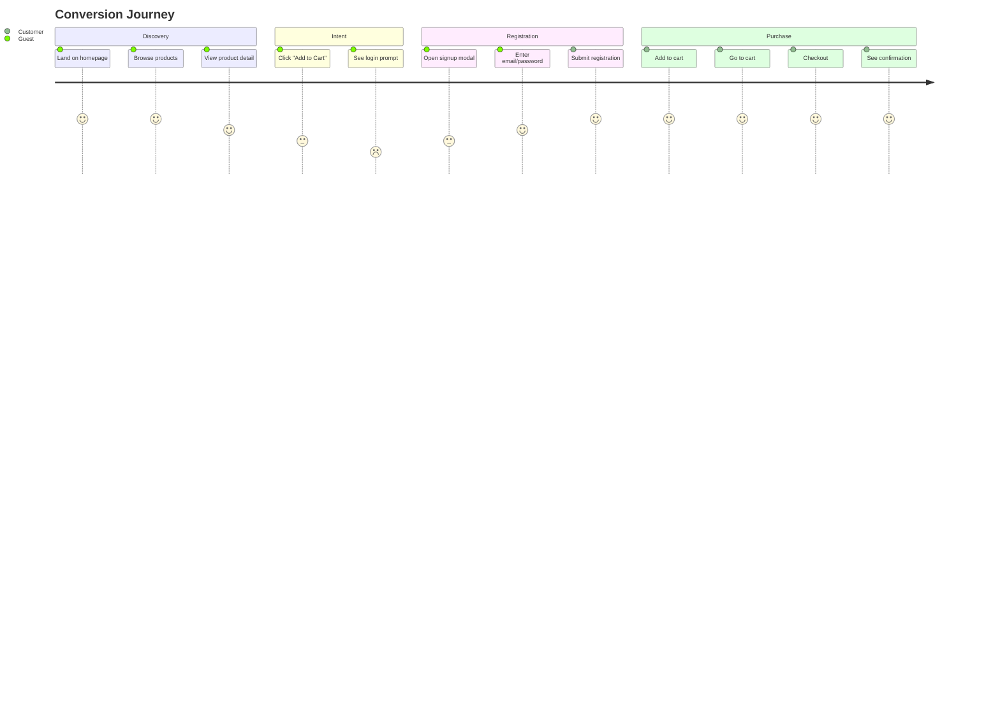
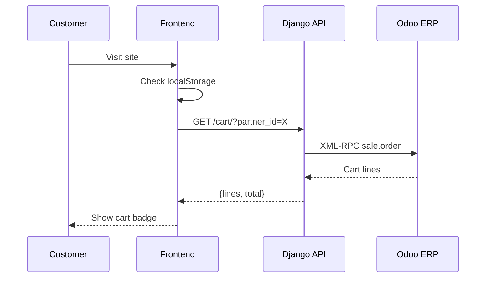
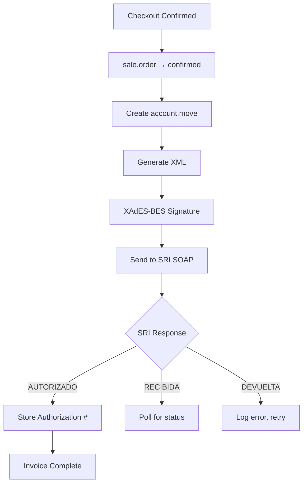

# SITE-DEFINITION-SOMATECH-ECUADOR
> **E-Commerce Site Definition**
> **Version**: 1.0 | **Date**: 2026-01-24

---

## 1. Business Overview

### 1.1 Business Model
| Aspect | Definition |
|--------|------------|
| **Type** | B2C E-Commerce |
| **Market** | Ecuador (nationwide) |
| **Currency** | USD (único) |
| **Language** | Spanish (es-EC) |
| **Tax Regime** | IVA 15% included in all prices |

### 1.2 Value Proposition
- **Premium technology products** with local warranty
- **SRI-compliant invoicing** on every purchase
- **Nationwide shipping** to all provinces
- **Integrated ERP** for real-time inventory

---

## 2. Product Taxonomy

### 2.1 Category Structure
```
├── Computación
│   ├── Laptops
│   ├── Desktops
│   └── Componentes
├── Móviles
│   ├── Smartphones
│   └── Tablets
├── Periféricos
│   ├── Teclados
│   ├── Mouse
│   └── Monitores
├── Audio
│   ├── Audífonos
│   └── Parlantes
└── Accesorios
    ├── Cables
    └── Fundas
```

### 2.2 Product Attributes
| Attribute | Type | Source |
|-----------|------|--------|
| Name | String | Odoo `product.product.name` |
| SKU | String | Odoo `default_code` |
| Price | Decimal | Odoo `list_price` (IVA included) |
| Stock | Integer | Odoo `qty_available` |
| Image | URL | Odoo image attachment |
| Category | FK | Odoo `categ_id` |

---

## 3. User Journeys

### 3.1 Guest → Customer Conversion



### 3.2 Returning Customer



---

## 4. Page Inventory

| Page | Route | Purpose | Components |
|------|-------|---------|------------|
| Home / Catalog | `/` | Browse products | `catalog-page`, `product-grid`, `product-card` |
| Cart | `/cart` | Review items | `cart-page`, `cart-item`, `cart-summary` |
| Checkout Success | (modal) | Order confirmed | Toast notification |
| Auth | (modal) | Login / Register | `login-modal` |

---

## 5. Checkout Flow

### 5.1 Steps
| Step | Action | Backend Effect |
|------|--------|----------------|
| 1 | User clicks "Confirmar Pedido" | - |
| 2 | Frontend calls `POST /cart/checkout` | - |
| 3 | Django confirms Odoo `sale.order` | `state` → `sale` |
| 4 | Odoo creates `account.move` (invoice) | Invoice draft |
| 5 | Odoo signs & sends to SRI | `l10n_ec_authorization_number` populated |
| 6 | Frontend shows "Pedido confirmado" | - |

### 5.2 Payment Methods

> [!IMPORTANT]
> **Phase 1**: Cash on delivery only. Payment gateway integration in Phase 2.

| Method | Status | Integration |
|--------|--------|-------------|
| Cash on Delivery | ✅ Active | None required |
| Bank Transfer | 🔜 Phase 2 | Manual verification |
| DeUna | 🔜 Phase 2 | QR code payment |
| PayPhone | 🔜 Phase 3 | Mobile payment |

---

## 6. SRI Invoice Workflow

### 6.1 Invoice Generation



### 6.2 Required Customer Data for Invoice

| Field | Required | Notes |
|-------|----------|-------|
| Name | ✅ Yes | `res.partner.name` |
| Email | ✅ Yes | For electronic invoice delivery |
| RUC/Cédula | Optional | If empty → "Consumidor Final" |
| Address | Optional | For delivery |

### 6.3 Consumidor Final Rules

| Condition | Invoice Type |
|-----------|--------------|
| No RUC/Cédula provided | Consumidor Final (9999999999999) |
| Total > $50 USD | Must request identification |
| Customer provides Cédula | Standard invoice with Cédula |
| Customer provides RUC | Standard invoice with RUC |

---

## 7. Design Specifications

### 7.1 Color Palette

| Token | Hex | Usage |
|-------|-----|-------|
| `--color-primary` | `#1a237e` | Primary actions, header |
| `--color-secondary` | `#ffb300` | Highlights, prices |
| `--color-accent` | `#e53935` | Alerts, badges |
| `--color-bg-primary` | `#0f0f23` | Page background |
| `--color-success` | `#4caf50` | Stock available |
| `--color-danger` | `#f44336` | Errors, out of stock |

### 7.2 Typography

| Element | Font | Size | Weight |
|---------|------|------|--------|
| H1 | Inter | 2.5rem | 700 |
| H2 | Inter | 2rem | 600 |
| Body | Inter | 1rem | 400 |
| Price | Inter | 1.5rem | 700 |
| Caption | Inter | 0.875rem | 400 |

### 7.3 Responsive Breakpoints

| Breakpoint | Width | Layout |
|------------|-------|--------|
| Mobile | < 640px | 1 column grid |
| Tablet | 641-1024px | 2 column grid |
| Desktop | > 1024px | 3-4 column grid |

---

## 8. SEO & Analytics

### 8.1 Meta Tags
| Page | Title | Description |
|------|-------|-------------|
| Home | SomaTech Ecuador \| Tienda en Línea | Tecnología premium con facturación SRI |
| Cart | Carrito \| SomaTech Ecuador | Revisa tu pedido |

### 8.2 Tracking (Phase 2)
- Google Analytics 4
- Facebook Pixel
- Hotjar heatmaps

---

## 9. Revision History

| Version | Date | Author | Changes |
|---------|------|--------|---------|
| 1.0 | 2026-01-24 | Antigravity | Initial site definition |
